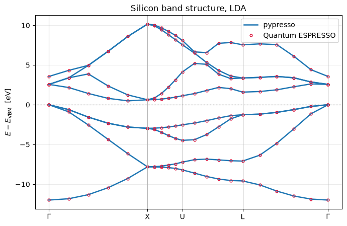

# Silicon: the SCF and the band structure

The canonical run: read a `pw.x` input, converge the density, diagonalise along a path.
Silicon's total energy comes out **within 1e-9 Ry of Quantum ESPRESSO** term by term and
its bands within **0.0002 eV**, on the same input file, `test-suite/pw_scf/scf.in`.

What is being minimised is the Kohn-Sham total energy as a functional of the density,

$$E[n] = T_s[n] + \int v_{\rm ext}(\mathbf r)\, n(\mathbf r)\, d\mathbf r
        + E_{\rm H}[n] + E_{\rm xc}[n] + E_{\rm ion-ion},$$

and self-consistency is the statement that the density built from the eigenstates of the
potential $v[n]$ is the same $n$ that produced it.

Notebook 01 builds the plane-wave basis this stands on, and notebook 00 is about the
`Calculator` used here.


```python
from pathlib import Path

import matplotlib.pyplot as plt
import numpy as np

from pypresso import Calculator
from pypresso.io import read_qe_output
from pypresso.io.pwin import read_pw_input
from pypresso.system import build_system

QE = Path("../quantum_espresso/qe-7.5-ReleasePack/qe-7.5/test-suite/pw_scf")
PSEUDO = Path("../tests/data/pseudo")

calc = Calculator.from_file(QE / "scf.in", pseudo_dir=PSEUDO)
system, pseudos = calc.system, calc.pseudos

print(system.structure)
print(pseudos[0])

```

    Structure(
      positions=f64[2,3],
      types=(0, 0),
      species=(Species(name='Si', mass=28.086, pseudo_file='Si.pz-vbc.UPF'),),
      if_pos=((1, 1, 1), (1, 1, 1))
    )
    Pseudopotential(Si, NC, Z=4, 2 projectors (l=[0, 1]), mesh 431 (msh 359), SLA  PZ   NOGX NOGC)


## Converge the density

One call. Inside it is the loop that is the whole of density functional theory in
practice: build the potential from the density, diagonalise at each k-point, build a new
density from the occupied states and symmetrise it, mix it into the old one, repeat.

Two of those steps are easy to skip and neither fails loudly. **Symmetrisation:** two
k-points stand in for the whole zone only because of symmetry, and the density built from
them alone does not have the crystal's, so the total comes out wrong in the third decimal
with degeneracies split by tens of meV. **Mixing:** feeding the output density straight
back in diverges, charge sloshing across the cell amplified by the Hartree term.


```python
result = calc.get_scf(conv_thr=1e-10, verbose=True)
print(f"\nconverged: {result.converged} in {result.iterations} iterations")

```

      iteration   1   ethr was too large; diagonalising again at 7.94e-04
      iteration   1   E =     -16.03252699 Ry   accuracy = 6.39e-02   ethr = 7.94e-04   |drho| = 3.67e-02
      iteration   2   E =     -15.81552817 Ry   accuracy = 2.30e-03   ethr = 7.99e-04   |drho| = 7.80e-03
      iteration   3   E =     -15.78486119 Ry   accuracy = 7.54e-05   ethr = 2.88e-05   |drho| = 8.88e-04
      iteration   4   E =     -15.79744382 Ry   accuracy = 6.35e-06   ethr = 9.43e-07   |drho| = 3.05e-04
      iteration   5   E =     -15.79424377 Ry   accuracy = 6.50e-08   ethr = 7.93e-08   |drho| = 3.79e-05
      iteration   6   E =     -15.79448235 Ry   accuracy = 8.10e-10   ethr = 8.12e-10   |drho| = 5.08e-06
      iteration   7   E =     -15.79449557 Ry   accuracy = 6.66e-11   ethr = 1.01e-11   |drho| = 1.48e-06


    
    converged: True in 7 iterations


## Check it against Quantum ESPRESSO, term by term

Comparing only the total is too forgiving: the total energy is variational, so it is
second-order accurate in the error of the density and can look right while a term inside
it is wrong. The decomposition localises an error to one piece of physics.


```python
# A re-run of pw.x on this input rather than the shipped reference, which dates from
# QE 6.0 and stops at conv_thr = 1e-6, well above the level compared here.
reference = read_qe_output(Path("../tests/data/qe/reference.out.pw_scf-scf"))

print("%-14s %16s %18s %12s" % ("term [Ry]", "pypresso", "Quantum ESPRESSO", "difference"))
for term, value in result.energy_terms.items():
    print("%-14s %16.8f %18.8f %12.1e" % (term, value, reference.energy_terms[term],
                                          value - reference.energy_terms[term]))
print("%-14s %16.8f %18.8f %12.1e" % ("TOTAL", result.total_energy, reference.total_energy,
                                      result.total_energy - reference.total_energy))
```

    term [Ry]              pypresso   Quantum ESPRESSO   difference
    one-electron         4.83371975         4.83371826      1.5e-06
    hartree              1.08439441         1.08439697     -2.6e-06
    xc                  -4.81285115        -4.81285222      1.1e-06
    ewald              -16.89975858       -16.89975858      2.8e-09
    TOTAL              -15.79449557       -15.79449557     -8.7e-10


## The band structure

With the density converged the potential is frozen and the Hamiltonian is diagonalised
along a path. Nothing about that is self-consistent, which is why it can use k-points that
would make no sense as an integration grid. The path is `scf-1.in`'s, and that input runs
after `scf.in` sharing its output directory, so its reference bands belong to precisely
the density converged above.


```python
band_system = build_system(read_pw_input(QE / "scf-1.in"))
bands = calc.get_bands(kpoints=band_system.kpoints, nbnd=8)
theirs = read_qe_output(QE / "benchmark.out.git.inp=scf-1.in").eigenvalues[0]
ours = bands.eigenvalues_ev

x, homo = bands.path_length, ours[:, 3].max()
fig, ax = plt.subplots(figsize=(7, 4.6))
for band in range(ours.shape[1]):
    ax.plot(x, ours[:, band] - homo, "-", color="C0", lw=1.8,
            label="pypresso" if band == 0 else None)
    ax.plot(x, theirs[:, band] - homo, "o", color="crimson", ms=3.5, mfc="none",
            label="Quantum ESPRESSO" if band == 0 else None)
ax.axhline(0, color="k", lw=0.8, ls=":")
for vertex in x[::5]:
    ax.axvline(vertex, color="0.7", lw=0.8)
ax.set_xticks(x[::5]); ax.set_xticklabels([r"$\Gamma$", "X", "U", "L", r"$\Gamma$"])
ax.set_ylabel(r"$E - E_{\rm VBM}$  [eV]"); ax.set_title("Silicon band structure, LDA")
ax.legend(loc="upper right"); ax.grid(alpha=0.25, axis="y")
fig.tight_layout()

print("max |difference| from QE: %.5f eV" % np.abs(ours - theirs).max())
print("indirect gap: %.4f eV   (LDA underestimates; experiment is ~1.1 eV)" % bands.gap(8))
```

    max |difference| from QE: 0.00025 eV
    indirect gap: 0.4885 eV   (LDA underestimates; experiment is ~1.1 eV)


    

    


The curves and the circles lie on top of each other to 0.2 meV, and the threefold
degeneracies at $\Gamma$ are exact rather than approximate, which is the visible payoff of
symmetrising the density. The gap is indirect, running from $\Gamma$ to a point most of
the way out to X, and LDA puts it well below the experimental 1.17 eV: the band gap
problem, in one number.

## What the density looks like

The physical content of the run, evaluated straight from its Fourier components: charge
piled up between the two atoms, which is the covalent bond of diamond silicon.


```python
from pypresso.basis.builder import build_basis
from pypresso.basis.fft import r_to_g

basis = build_basis(system)
rho_g = np.asarray(r_to_g(result.total_density, basis.dense.fft_index))
g_cart = np.asarray(basis.dense.cartesian(system.cell))
tau = np.asarray(system.structure.positions)

bond = tau[1] - tau[0]
e1 = bond / np.linalg.norm(bond)
e2 = np.cross(e1, [0.0, 0.0, 1.0]); e2 /= np.linalg.norm(e2)
span = np.linspace(-3.5, 8.0, 200)
u, v = np.meshgrid(span, span, indexing="ij")
plane = (tau[0] + u[..., None] * e1 + v[..., None] * e2).reshape(-1, 3)
image = (np.exp(1j * plane @ g_cart.T) * rho_g).sum(axis=1).real.reshape(u.shape)

fig, ax = plt.subplots(figsize=(5.4, 4.2))
mesh = ax.contourf(span, span, image.T, levels=40, cmap="viridis")
ax.scatter([0.0, np.linalg.norm(bond)], [0.0, 0.0], s=90, facecolors="none",
           edgecolors="white", lw=1.8)
ax.set_aspect("equal"); ax.set_xlabel("bohr, along the Si-Si bond")
ax.set_ylabel("bohr, perpendicular")
ax.set_title(r"Valence density [electrons/bohr$^3$]")
fig.colorbar(mesh, ax=ax); fig.tight_layout()

density = np.asarray(result.total_density)
print("integral over the cell = %.8f electrons"
      % (density.sum() * float(system.cell.volume) / density.size))
```

    integral over the cell = 8.00000000 electrons


    

    


---
The tests behind this notebook: `tests/regression/test_scf.py`,
`tests/unit/test_qeref.py`.
