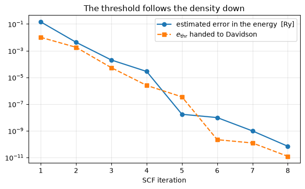
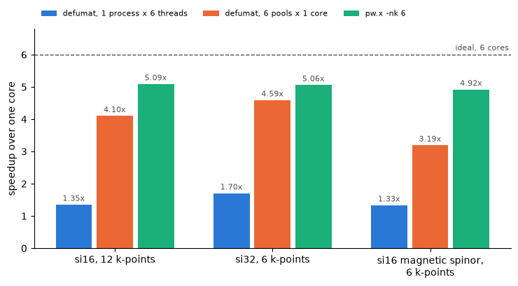

# The eigensolver, and how fast this is

The SCF spends almost all of its time diagonalising, so the eigensolver decides what size
of problem is reachable. Forming $H$ and calling `eigh` costs $O(n_{\rm pw}^3)$ time and
$O(n_{\rm pw}^2)$ memory; a block Davidson gets the same eigenvalues to 1e-13 Ry at a
fraction of both, and with it defumat runs **within 2-4x of serial Quantum ESPRESSO per
SCF iteration**.

What is solved at every k-point is a *generalised* eigenproblem, because ultrasoft and PAW
pseudopotentials make the overlap non-trivial:

$$\hat H\,|\psi_{n\mathbf k}\rangle
 = \varepsilon_{n\mathbf k}\,\hat S\,|\psi_{n\mathbf k}\rangle ,
\qquad
\hat S = 1 + \sum_{I,ij} q^I_{ij}\,|\beta^I_i\rangle\langle\beta^I_j|$$

Davidson never forms $\hat H$: it applies it to a block of vectors, adds the preconditioned
residuals $|r_n\rangle = (\hat H - \varepsilon_n \hat S)|\psi_n\rangle$ to the subspace, and
diagonalises there. Every timing below is single core, which is the only honest comparison
against a serial `pw.x`.


```python
# XLA must be pinned before JAX is imported, so this comes first.
import os

os.environ["XLA_FLAGS"] = "--xla_cpu_multi_thread_eigen=false intra_op_parallelism_threads=1"
os.environ["OMP_NUM_THREADS"] = "1"

import time
from pathlib import Path

import jax
import jax.numpy as jnp
import matplotlib.pyplot as plt
import numpy as np

from defumat import Calculator
from defumat.scf.driver import run_scf
from defumat.scf.potential import v_of_rho
from defumat.solvers import davidson_eigensolver_all

BENCH, PSEUDO = Path("../benchmarks"), Path("../tests/data/pseudo")


def load(name):
    return Calculator.from_file(BENCH / name, pseudo_dir=PSEUDO, announce=False)


def timed(function, repeats=5):
    jax.block_until_ready(function())                    # the first call compiles
    start = time.perf_counter()
    for _ in range(repeats):
        value = jax.block_until_ready(function())
    return (time.perf_counter() - start) / repeats * 1e3, value


def exact_eigenpairs(hamiltonian, nbnd):
    """Form `H` and diagonalise: the answer Davidson has to reproduce."""
    matrix, mask = hamiltonian.matrix(0), hamiltonian.state_mask[0]
    shift = jnp.max(jnp.abs(matrix)) * 1000.0 + 1.0
    matrix = jnp.where(mask[:, None] & mask[None, :], matrix, 0.0)
    matrix = matrix + jnp.diag(jnp.where(mask, 0.0, shift))
    return jnp.linalg.eigh(matrix)[0][:nbnd]
```

## Davidson against the exact answer, and what it saves

Same Hamiltonian, both routes, at two cutoffs. The eigenvalues agree to 1e-13 Ry and the
gap in cost opens with the size of the basis, which is the entire point.


```python
potential_of_rho = jax.jit(v_of_rho)
rows = []
for name in ("si-1k.in", "si-1k-ecut40.in"):
    calc = load(name)
    calculation = calc.calculation
    potential = potential_of_rho(calculation.starting_density(),
                                 calculation.basis.dense, calc.system.cell)
    h = calculation.hamiltonian(potential.v_scf)[0]        # one per spin channel

    exact_ms, exact = timed(lambda: exact_eigenpairs(h, 4), 3)
    dav_ms, dav = timed(
        lambda: davidson_eigensolver_all(h, 4, None, max_iterations=60), 3)
    agreement = np.abs(np.asarray(exact) - np.asarray(dav[0])[0]).max()
    rows.append((name, calculation.basis.npwx, exact_ms, dav_ms, agreement))
    print("  %-17s npw %5d   form H + eigh %8.1f ms   Davidson %6.1f ms  (%4.1fx)"
          "   agree to %.0e Ry" % (name, calculation.basis.npwx, exact_ms, dav_ms,
                                   exact_ms / dav_ms, agreement))
```

      si-1k.in          npw   180   form H + eigh     13.9 ms   Davidson   10.9 ms  ( 1.3x)   agree to 1e-13 Ry


      si-1k-ecut40.in   npw  1131   form H + eigh   1256.6 ms   Davidson   72.2 ms  (17.4x)   agree to 1e-13 Ry


## Asking for only as much accuracy as the density deserves

An early SCF iteration whose density is wrong in the second decimal has nothing to gain
from eigenvalues good to 1e-12 Ry, so the diagonalisation threshold follows the error in
the density down. A fixed tight threshold does about three times the eigensolver work for
the same answer, and this schedule is why `conv_thr` here means what it means in a `pw.x`
input.


```python
result = load("si-1k-ecut40.in").get_scf(conv_thr=1e-10)
history = result.history

fig, ax = plt.subplots(figsize=(6.4, 4))
iterations = [row["iteration"] for row in history]
ax.semilogy(iterations, [row["accuracy"] for row in history], "o-", lw=1.7,
            label="estimated error in the energy  [Ry]")
ax.semilogy(iterations, [row["ethr"] for row in history], "s--", lw=1.7,
            label=r"$e_{\rm thr}$ handed to Davidson")
ax.set_xlabel("SCF iteration"); ax.set_title("The threshold follows the density down")
ax.legend(); ax.grid(alpha=0.3, which="both"); fig.tight_layout()

print("converged to %.2e Ry in %d iterations" % (history[-1]["accuracy"], result.iterations))
```

    converged to 6.89e-11 Ry in 8 iterations


    

    


## Symmetry is worth more than any micro-optimisation

Reducing an automatic k-grid to the irreducible wedge divides the work by the number of
operations that relate its points, 8 k-points to 2 on the cell below, for the same total
energy to 1e-10 Ry. Nothing about the arithmetic got faster: the crystal simply has fewer
distinct k-points in it than the grid has points.


```python
from defumat.system.kpoints import KPoints
from defumat.system.symmetry import find_symmetries

QE = Path("../quantum_espresso/qe-7.5-ReleasePack/qe-7.5/test-suite/pw_scf")
wedge = Calculator.from_file(QE / "scf-kauto.in", pseudo_dir=PSEUDO, announce=False)
full = wedge.with_kpoints(
    KPoints.automatic((2, 2, 2), (1, 1, 1), wedge.system.cell))

print("  %d symmetry operations"
      % find_symmetries(wedge.system.cell, wedge.system.structure).nsym)
for label, variant in (("full grid", full), ("irreducible wedge", wedge)):
    setup = variant.calculation
    run_once = lambda: run_scf(variant.system, variant.pseudos,
                               calculation=setup, conv_thr=1e-10)
    run = run_once()                                                  # compile
    best = min(timed(run_once, 1)[0] for _ in range(3))
    print("  %-18s %d k-points   %6.1f ms/iteration   E = %.9f Ry"
          % (label, variant.system.kpoints.nk, best / run.iterations, run.total_energy))
```

      48 symmetry operations


      full grid          8 k-points     25.1 ms/iteration   E = -15.794495571 Ry


      irreducible wedge  2 k-points     12.9 ms/iteration   E = -15.794495571 Ry


## Against Quantum ESPRESSO, single core

Both codes on the same input, QE built serial and this one pinned to one thread, reading
QE's own timing report. Measured on this machine and quoted rather than re-run, since it
needs a `pw.x` binary:

| | `si-1k` 2 atoms | `si-1k-ecut40` 2 atoms | `si8-1k-ecut30` 8 atoms | `si16-1k-ecut30` 16 atoms |
|---|---|---|---|---|
| plane waves | 180 | 1131 | 2950 | 5900 |
| QE, per SCF iteration | 0.003 s | 0.011 s | 0.071 s | 0.278 s |
| defumat, per SCF iteration | 0.007 s | 0.033 s | 0.254 s | 1.141 s |
| ratio | **2.8x** | **3.0x** | **3.6x** | **4.1x** |
| total energy agreement | 7e-7 Ry | 3e-9 Ry | 4e-9 Ry | 1e-9 Ry |

Both codes are doing the same physics with the same convergence, so the ratio is a like
for like statement about cost, and it says a production-sized cell is within reach on one
core. The parallel axis beyond that is the k-points, which are independent of each other
and never mixed until the density is accumulated.

## One calculation on many cores: k-point pools

What does a core buy when it is given its own k-points instead of a share of one k-point's
threads? Inside one k-point the work is a chain of operations each the size of one band's
transform, too fine for threads to pay much, so the cores go to the k-points, which is
`pw.x -nk`. `DEFUMAT_POOLS` runs one calculation as that many processes, each diagonalising
its own block of k-points; the density and the decisions are shared every iteration, and the
numbers are those of one process to round-off. Below, silicon with one atom displaced, on a
2x2x2 grid without symmetry (eight k-points), as one process and as two pools; the same
script runs in every pool.


```python
import json, os, socket, subprocess, sys, tempfile, textwrap

SCRIPT = textwrap.dedent("""
    import json, sys, warnings
    warnings.simplefilter("ignore")
    from defumat import Calculator
    from defumat.parallel import current_pools
    calc = Calculator.from_file("scf.in", pseudo_dir=sys.argv[1], announce=False)
    result = calc.get_scf(conv_thr=1e-10)
    forces = calc.get_forces()
    if current_pools().rank == 0:
        print(json.dumps({"energy": result.total_energy, "max_force": forces.max_force}))
""")

source = (BENCH / "si-1k.in").read_text()
source = source[: source.index("K_POINTS")] + "K_POINTS automatic\n 2 2 2 0 0 0\n"
source = source.replace("ecutwfc=12.0", "ecutwfc=12.0, nosym=.true., noinv=.true.")
source = source.replace(" Si 0.25 0.25 0.25", " Si 0.27 0.25 0.24")
work = Path(tempfile.mkdtemp())
(work / "scf.in").write_text(source)


def run_pools(size):
    """The script as `size` pools, each on its own core; rank 0's line back."""
    with socket.socket() as sock:
        sock.bind(("localhost", 0))
        port = sock.getsockname()[1]
    base = {k: v for k, v in os.environ.items() if not k.startswith("DEFUMAT_POOL")}
    base.update(JAX_PLATFORMS="cpu", DEFUMAT_THREADS="1",
                PYTHONPATH=str(Path("..").resolve()))
    processes = []
    for rank in range(size):
        env = dict(base)
        if size > 1:
            env.update(DEFUMAT_POOLS=str(size), DEFUMAT_POOL_RANK=str(rank),
                       DEFUMAT_COORDINATOR=f"localhost:{port}")
        processes.append(subprocess.Popen(
            [sys.executable, "-c", SCRIPT, str(PSEUDO.resolve())], cwd=work, env=env,
            stdout=subprocess.PIPE, stderr=subprocess.DEVNULL, text=True))
    lines = [process.communicate(timeout=600)[0] for process in processes]
    return json.loads(lines[0].strip().splitlines()[-1])


one, two = run_pools(1), run_pools(2)
print(f"one process   E = {one['energy']:.10f} Ry   max |F| = {one['max_force']:.10f} Ry/bohr")
print(f"two pools     E = {two['energy']:.10f} Ry   max |F| = {two['max_force']:.10f} Ry/bohr")
print(f"difference    {abs(one['energy'] - two['energy']):.1e} Ry   "
      f"{abs(one['max_force'] - two['max_force']):.1e} Ry/bohr")
```

    one process   E = -15.6047514426 Ry   max |F| = 0.0751105304 Ry/bohr
    two pools     E = -15.6047514426 Ry   max |F| = 0.0751105304 Ry/bohr
    difference    1.8e-15 Ry   8.3e-16 Ry/bohr


The two agree to round-off, the energy and the force alike: one process takes the force
from a single gradient over every k-point, the two pools each walk their own and add the
results, and those are two routes to the same derivative.

What the pools are worth is a measurement on identical cores, so it is quoted here rather
than re-run: six performance cores of an i5-12600K, every process and every `pw.x` MPI rank
pinned to its own core, cells without symmetry, speedup over the same code on one core.


```python
cells = ["si16, 12 k-points", "si32, 6 k-points", "si16 magnetic spinor,\n6 k-points"]
threads = [1.35, 1.70, 1.33]    # one process, six threads
pools = [4.1, 4.59, 3.19]       # six pools, one core each
qe = [5.09, 5.06, 4.92]         # pw.x -nk 6, six ranks

fig, ax = plt.subplots(figsize=(7.5, 4.2))
x = np.arange(len(cells))
width = 0.26
series = [("defumat, 1 process x 6 threads", threads, "#2a78d6"),
          ("defumat, 6 pools x 1 core", pools, "#eb6834"),
          ("pw.x -nk 6", qe, "#1baf7a")]
for i, (label, values, color) in enumerate(series):
    bars = ax.bar(x + (i - 1) * width, values, width - 0.03, label=label, color=color)
    ax.bar_label(bars, labels=[f"{v:.2f}x" for v in values], padding=2, fontsize=8,
                 color="#52514e")
ax.axhline(6, color="#52514e", linestyle="--", linewidth=1)
ax.text(len(cells) - 0.5, 6.08, "ideal, 6 cores", ha="right", va="bottom", fontsize=8,
        color="#52514e")
ax.set_xticks(x, cells)
ax.set_ylabel("speedup over one core")
ax.set_ylim(0, 6.8)
ax.spines[["top", "right"]].set_visible(False)
ax.legend(frameon=False, fontsize=8, loc="upper left", ncols=3,
          bbox_to_anchor=(0, 1.12))
fig.tight_layout()
plt.show()
```


    

    


Six pools give what threads cannot, about four times one core on the scalar cells, 80 to 91
per cent of `pw.x`'s own speedup there. The spinor cell reaches 65 per cent, and the reason
is physical rather than the pools': its Gamma point needs twice the Davidson steps of the
other k-points, in `pw.x` too, and with one k-point per pool the others wait for it.

---
`PERFORMANCE.md` carries the full breakdown. The tests behind this notebook:
`tests/unit/test_solvers.py`, `tests/regression/test_batching_scf.py`, `tests/unit/test_parallel.py`, `tests/unit/test_plane_chunk.py`.
