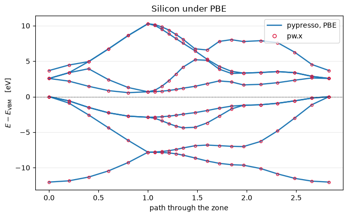

# Gradient corrections: PBE, revPBE and PBEsol

An LDA functional sees only the density at a point; a GGA also sees its gradient. That costs
one new term in the potential -- a divergence -- and buys most of what published plane-wave
work is done with.

A GGA multiplies the local exchange energy by an enhancement factor of the *reduced*
gradient, and the potential is the functional derivative of that, which is where the second
term comes from:

$$E_x^{\rm GGA}[\rho] = \int \rho\,\epsilon_x^{\rm LDA}(\rho)\,F(s)\;d\mathbf r,
\qquad s = \frac{|\nabla\rho|}{2 k_F \rho},
\qquad k_F = (3\pi^2\rho)^{1/3}$$

$$v_{xc} = \frac{\partial E_{xc}}{\partial \rho}
  - \nabla\cdot\frac{\partial E_{xc}}{\partial \nabla\rho}
  \;\equiv\; v_1 - \nabla\cdot\!\left(v_2 \nabla\rho\right)$$

Only the energy functional is written down here; both potentials are obtained by
differentiating it, so a new functional is one expression and no accompanying algebra.

| against `pw.x` | defumat | difference |
|---|---|---|
| PBE, norm-conserving silicon | **-15.727897810 Ry** | 2.7e-10 |
| PBE, **ultrasoft** | **-22.822566057 Ry** | 2.7e-09 |
| PBE, **PAW** | **-93.439615230 Ry** | 1.1e-10 |
| **revPBE**, same cell | **-15.734397095 Ry** | 4.6e-09 |
| **PBEsol**, same cell | **-15.696395527 Ry** | 3.4e-09 |
| the bands along the same path | | 0.052 meV |


```python
import warnings
from pathlib import Path

import matplotlib.pyplot as plt
import numpy as np

from defumat import Calculator
from defumat.io import comparison_table, read_qe_output

CASES, PSEUDO = Path("../tests/data/qe"), Path("../tests/data/pseudo")

# revPBE and PBEsol run a PBE-generated dataset, on purpose; see below.
warnings.filterwarnings("ignore", message="input_dft asks for")

pbe = Calculator.from_file(CASES / "si2-nc-pbe.in", pseudo_dir=PSEUDO, announce=False)
print("silicon, PBE:   E = %.9f Ry" % pbe.get_scf().total_energy)
```

    silicon, PBE:   E = -15.727897810 Ry


The functional was not chosen at the call. It comes from the pseudopotential's own header,
because a dataset is generated *with* a functional and running it under another one is an
inconsistency rather than a preference -- `input_dft` overrides it and the package says so
when it does. QE composes a functional out of four independently chosen slots and a UPF
header names all four, which is why the same is done here rather than matching on a name.

## What the three functionals disagree about

All of them multiply the local exchange energy by an enhancement factor $F(s)$. They differ
only in how fast it saturates and where: **revPBE** raises the ceiling, which improves atomic
and molecular energies, and **PBEsol** lowers the slope at small $s$, which improves lattice
constants and surface energies of solids.


```python
from defumat.xc.functional import get_functional   # no facade route to one functional

rho = 0.05
s = np.linspace(0.0, 3.0, 300)
kf = (3.0 * np.pi**2 * rho) ** (1.0 / 3.0)
sigma = (s * 2.0 * kf * rho) ** 2               # |grad rho|^2 at each s, at fixed rho

fig, ax = plt.subplots(figsize=(6.2, 4.0))
for name, style in (("PBE", "-"), ("REVPBE", "--"), ("PBESOL", ":")):
    functional = get_functional(name)
    gga = np.asarray(functional.gradient_energy(np.full_like(sigma, rho), sigma))
    lda = float(rho * functional.exchange(rho))
    ax.plot(s, 1.0 + gga / lda, style, lw=1.8, label=name)
ax.axhline(1.0, color="k", lw=0.6)
ax.set_xlabel("reduced gradient $s$")
ax.set_ylabel("enhancement factor $F(s)$")
ax.set_title(r"Exchange enhancement at $\rho = %.2f$" % rho)
ax.legend()
ax.grid(alpha=0.3)
fig.tight_layout()
```


    

    


$F(0) = 1$ in all three, which is the uniform gas and is not negotiable: a GGA has to
reduce to LDA where the density is flat. Everything above that is the model.

The second potential enters as $-\nabla\cdot(v_2\nabla\rho)$, a divergence, so it integrates
to zero over the cell and moves no charge at all -- it only redistributes it, sharpening the
potential where the density varies fastest. That is exactly where LDA is worst, which is why
a GGA helps most at surfaces, in bonds, and around light atoms.

## Against Quantum ESPRESSO

Three pseudopotential kinds under PBE, then three functionals on the same norm-conserving
cell.


```python
rows = []
for case, label in (("si2-nc-pbe", "PBE, norm-conserving"), ("si2-us-pbe", "PBE, ultrasoft"),
                    ("si2-paw-pbe", "PBE, PAW"), ("si2-nc-revpbe", "revPBE"),
                    ("si2-nc-pbesol", "PBEsol")):
    ours = Calculator.from_file(CASES / f"{case}.in", pseudo_dir=PSEUDO,
                                announce=False).get_scf()
    rows.append((label, ours.total_energy,
                 read_qe_output(CASES / f"reference.out.{case}").total_energy))

print(comparison_table(rows, fmt="{:.9f}",
                       headers=("case", "defumat [Ry]", "pw.x", "difference")))
```

    case                  defumat [Ry]           pw.x  difference
    PBE, norm-conserving  -15.727897810  -15.727897810     2.7e-10
    PBE, ultrasoft        -22.822566057  -22.822566060     2.7e-09
    PBE, PAW              -93.439615230  -93.439615230     1.1e-10
    revPBE                -15.734397095  -15.734397090     4.6e-09
    PBEsol                -15.696395527  -15.696395530     3.4e-09


The last two rows carry a warning, silenced in the first cell: they run a PBE-generated
dataset under a *different* functional. That is what `input_dft` is for and it is deliberate
here, so that the three functionals are compared on one crystal rather than on three
datasets -- but it is an inconsistency, `pw.x` says so too, and a published number should not
be got this way.

## The bands, and what a gradient correction does not fix

PBE moves silicon's bands by tens of meV against LDA and its gap from 0.49 eV to 0.57 --
still half of the measured 1.17. **The band gap of a Kohn-Sham calculation is not the quantity
experiment measures**, and no gradient correction repairs that; notebook 24 is what does.
What PBE repairs is the energetics, which is why it is what structures, binding energies and
forces are computed with.


```python
path = Calculator.from_file(CASES / "si2-nc-pbe-bands.in", pseudo_dir=PSEUDO,
                            announce=False).system
bands = pbe.get_bands(kpoints=path.kpoints, nbnd=8)
theirs = read_qe_output(CASES / "reference.out.si2-nc-pbe-bands").eigenvalues[0]
ours = bands.eigenvalues_ev - bands.eigenvalues_ev[:, 3].max()

fig, ax = plt.subplots(figsize=(7.0, 4.4))
ax.plot(bands.path_length, ours, "-", color="C0", lw=1.7)
ax.plot(bands.path_length, theirs - theirs[:, 3].max(), "o", color="crimson", ms=3.5,
        mfc="none")
ax.plot([], [], "-", color="C0", lw=1.7, label="defumat, PBE")
ax.plot([], [], "o", color="crimson", ms=5, mfc="none", label="pw.x")
ax.axhline(0.0, color="k", lw=0.8, ls=":")
ax.set_xlabel("path through the zone")
ax.set_ylabel(r"$E - E_{\rm VBM}$   [eV]")
ax.set_title("Silicon under PBE")
ax.legend(loc="upper right")
ax.grid(alpha=0.25, axis="y")
fig.tight_layout()

print("largest eigenvalue difference from pw.x   %.3f meV"
      % (np.abs(bands.eigenvalues_ev - theirs).max() * 1e3))
print("PBE gap   %.3f eV   (measured 1.17)" % bands.gap(8))
```

    largest eigenvalue difference from pw.x   0.052 meV
    PBE gap   0.565 eV   (measured 1.17)


    

    


## What it refuses

An **unimplemented functional is refused rather than silently replaced by LDA**, which is the
failure mode that matters here: a run that quietly changes the physics and reports success is
worse than one that stops. The three above plus the LDA family are what is in; anything else
a UPF header can name is named back.

---
The tests behind this notebook: `tests/regression/test_gga.py`, which holds the total
energies, their term-by-term breakdown and the eigenvalues on all three kinds of dataset,
and the check that the functional comes from the pseudopotential; and
`tests/unit/test_xc.py`, which holds the potentials against the closed forms `XClib`
derives by hand -- $v_1$ and $v_2$ here are obtained by differentiating the energy, so those
two implementations share nothing and checking one against the other is the test.
