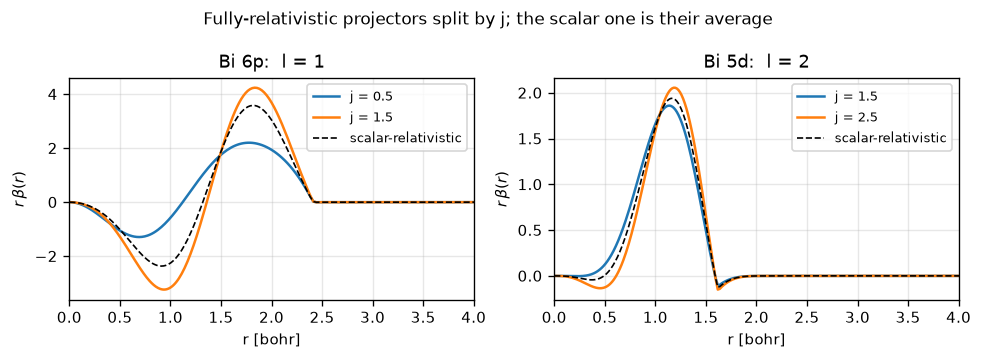
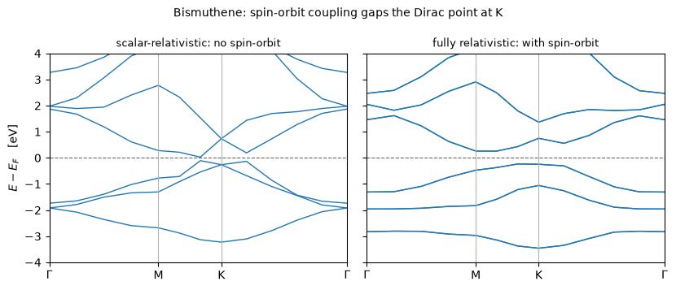

# Spin-orbit coupling

`noncolin = .true.` makes a wavefunction a two-component spinor of length `2 npwx`, so
there is **one** Hamiltonian on a space twice as large rather than two Hamiltonians;
`lspinorb = .true.` puts the `j`-resolved projectors of a fully-relativistic dataset into
it. Three platinum benchmarks — ultrasoft LDA, ultrasoft PBE and PAW — match Quantum
ESPRESSO to **≤1.3e-8 Ry**, and bismuthene's half-electronvolt gap is made of nothing but
the coupling.

**Keep three numbers apart**, because collapsing them is the mistake that makes a
spin-orbit run allocate a magnetization it does not have: `nspin` says which regime (1, 2
or 4), `npol` how many components a *wavefunction* has, and `nspin_mag` how many a
*density* has — which is **one** for a nonmagnetic spin-orbit run, exactly as for an
unpolarized one.

A state is a two-component spinor and the nonlocal term is a matrix in spin space, built
from the $j$-resolved projectors of the dataset:

$$|\psi_{n\mathbf k}\rangle =
  \begin{pmatrix} \psi^{\uparrow}_{n\mathbf k} \\[2pt]
                   \psi^{\downarrow}_{n\mathbf k} \end{pmatrix},
\qquad
\hat V_{\rm NL} = \sum_{I}\sum_{ij}\sum_{\alpha\beta}
   D^{I,\,\alpha\beta}_{ij}\;
   |\beta^I_i\rangle\langle\beta^I_j| \otimes |\alpha\rangle\langle\beta|$$

$D^{\alpha\beta}_{ij}$ is assembled from the Clebsch-Gordan coefficients that couple
$(l, m_l, \sigma)$ to $(j, m_j)$ -- QE's `fcoef` -- which is the whole of where the
coupling enters.

Phase P14.


```python
from pathlib import Path

import matplotlib.pyplot as plt
import numpy as np

from pypresso import Calculator
from pypresso.io import read_qe_output
from pypresso.pseudo import read_upf
from pypresso.units import RY_TO_EV

QE = Path("../quantum_espresso/qe-7.5-ReleasePack/qe-7.5/test-suite")
PSEUDO, CASES = Path("../tests/data/pseudo"), Path("../tests/data/qe")
plt.rcParams.update({"figure.dpi": 120, "font.size": 9, "axes.grid": True,
                     "grid.alpha": 0.3})


def load(path):
    return Calculator.from_file(path, pseudo_dir=PSEUDO, announce=False,
                                conv_thr=1e-10)


# A fully-relativistic dataset keeps two projectors where a scalar one keeps their average:
# j = l - 1/2 and j = l + 1/2, which is where the coupling physically lives.
relativistic = read_upf(PSEUDO / "Bi.rel-pbe-dn-rrkjus_psl.1.0.0.UPF")
scalar = read_upf(PSEUDO / "Bi.pbe-dn-rrkjus_psl.1.0.0.UPF")
for name, pseudo in (("Bi.rel-pbe-dn-rrkjus", relativistic), ("Bi.pbe-dn-rrkjus", scalar)):
    print("%-22s %2d projectors  has_so=%-5s  (l, j) = %s"
          % (name, pseudo.nbeta, pseudo.has_so,
             [(p.l, p.j) for p in pseudo.projectors]))

fig, axes = plt.subplots(1, 2, figsize=(8.2, 3.0))
for ax, l, label in ((axes[0], 1, "6p"), (axes[1], 2, "5d")):
    seen = set()
    for projector in relativistic.projectors:
        if projector.l != l or projector.j in seen:
            continue
        seen.add(projector.j)
        ax.plot(relativistic.r, projector.beta, label="j = %g" % projector.j)
    beta = next(p for p in scalar.projectors if p.l == l)
    ax.plot(scalar.r, beta.beta, "k--", lw=1.0, label="scalar-relativistic")
    ax.set_xlim(0, 4.0); ax.set_xlabel("r [bohr]")
    ax.set_ylabel(r"$r\,\beta(r)$"); ax.set_title("Bi %s:  l = %d" % (label, l))
    ax.legend(fontsize=8)
fig.suptitle("Fully-relativistic projectors split by j; the scalar one is their average",
             fontsize=10)
fig.tight_layout()
```

    Bi.rel-pbe-dn-rrkjus   10 projectors  has_so=True   (l, j) = [(0, 0.5), (0, 0.5), (1, 0.5), (1, 1.5), (1, 0.5), (1, 1.5), (2, 1.5), (2, 2.5), (2, 1.5), (2, 2.5)]
    Bi.pbe-dn-rrkjus        6 projectors  has_so=False  (l, j) = [(0, None), (0, None), (1, None), (1, None), (2, None), (2, None)]


    

    


## The identity that gates the whole spinor path

Before any spin-orbit number is believed: run a spinor calculation with a *scalar*
dataset, where the two components cannot mix, and the collinear answer must come back
term by term with every eigenvalue simply doubled. This is silicon, `noncolin = .true.`
and nothing else changed.


```python
import tempfile

text = (QE / "pw_scf" / "scf.in").read_text()
marker = text.lower().index("&system") + len("&system")
smeared = (text[:marker]
           + "\n    occupations='smearing', smearing='gaussian', degauss=0.02,\n"
           + text[marker:])
work = Path(tempfile.mkdtemp())
(work / "collinear.in").write_text(smeared)
(work / "noncollinear.in").write_text(
    smeared[:marker] + "\n    noncolin = .true.,\n" + smeared[marker:])

collinear_calc = load(work / "collinear.in")
spinor_calc = load(work / "noncollinear.in")
for label, s in (("collinear   ", collinear_calc.system),
                 ("noncollinear", spinor_calc.system)):
    print("%s:  nspin=%d npol=%d nspin_mag=%d"
          % (label, s.nspin, s.npol, s.nspin_mag))
print("             ^ nspin_mag is one: there is no magnetization to carry")

collinear = collinear_calc.get_scf(max_iterations=80)
spinor = spinor_calc.get_scf(max_iterations=80)
print("\n%14s %18s %18s %12s" % ("term", "collinear", "noncollinear", "difference"))
for term, value in collinear.energy_terms.items():
    print("%14s %18.12f %18.12f %12.1e"
          % (term, value, spinor.energy_terms[term], spinor.energy_terms[term] - value))
print("%14s %18.12f %18.12f %12.1e"
      % ("TOTAL", collinear.total_energy, spinor.total_energy,
         spinor.total_energy - collinear.total_energy))

doubled = np.repeat(collinear.eigenvalues, 2, axis=1)
n = doubled.shape[1]
print("\neigenvalues: %d bands -> %d, max |difference from doubling| = %.2e eV"
      % (collinear.eigenvalues.shape[1], spinor.eigenvalues.shape[1],
         np.abs(spinor.eigenvalues[:, :n] - doubled).max() * RY_TO_EV))
```

    collinear   :  nspin=1 npol=1 nspin_mag=1
    noncollinear:  nspin=4 npol=2 nspin_mag=1
                 ^ nspin_mag is one: there is no magnetization to carry


    
              term          collinear       noncollinear   difference
      one-electron     4.833721601574     4.833721601574     -6.2e-15
           hartree     1.084391608208     1.084391608208      2.4e-15
                xc    -4.812850203017    -4.812850203017      0.0e+00
             ewald   -16.899758577223   -16.899758577223      0.0e+00
          smearing    -0.000000000418    -0.000000000418     -1.0e-19
             TOTAL   -15.794495570876   -15.794495570876     -3.6e-15
    
    eigenvalues: 8 bands -> 16, max |difference from doubling| = 5.44e-14 eV


    /u/40/ladovj1/data/Documents/programs/claude/pypresso/pypresso/calculator.py:312: RuntimeWarning: tstress = .true. in the input, but forces and stress for a noncollinear or spin-orbit calculation are not implemented; nspin = 1 and nspin = 2 are, on norm-conserving, ultrasoft and PAW pseudopotentials. The SCF is unaffected and SCFResult.stress is None.
      self._scf = run_scf(self.system, self.pseudos,


## Platinum, against Quantum ESPRESSO

Three of QE's own benchmarks, on the three kinds of dataset that carry `j`. Note the
k-point weights: they sum to **one**, not two — a spinor band holds one electron.


```python
rows = []
for name, stem, label in (("spinorbit.in", "pw_spinorbit-spinorbit", "ultrasoft, LDA"),
                          ("spinorbit-pbe.in", "pw_spinorbit-spinorbit-pbe",
                           "ultrasoft, PBE"),
                          ("spinorbit-paw.in", "pw_spinorbit-spinorbit-paw", "PAW, PBE")):
    reference = read_qe_output(CASES / f"reference.out.{stem}")
    result = load(QE / "pw_spinorbit" / name).get_scf(max_iterations=100)
    eigen = np.abs(np.asarray(result.eigenvalues) * RY_TO_EV
                   - np.squeeze(np.asarray(reference.eigenvalues))).max()
    rows.append((label, result, reference, eigen))
    if name == "spinorbit.in":
        pt = result

print("%16s %18s %18s %10s %12s"
      % ("dataset", "pypresso (Ry)", "QE 7.5 (Ry)", "dE", "max de (eV)"))
for label, result, reference, eigen in rows:
    print("%16s %18.9f %18.9f %10.1e %12.1e"
          % (label, result.total_energy, reference.total_energy,
             result.total_energy - reference.total_energy, eigen))

levels = np.asarray(pt.eigenvalues)
print("\nmax Kramers splitting over all k: %.1e eV"
      % (np.abs(levels[:, 0::2] - levels[:, 1::2]).max() * RY_TO_EV))
print("(inversion and time reversal both hold, so every level is doubly degenerate)")
```

             dataset      pypresso (Ry)        QE 7.5 (Ry)         dE  max de (eV)
      ultrasoft, LDA      -69.491529507      -69.491529520    1.3e-08      3.6e-04
      ultrasoft, PBE      -90.199533906      -90.199533910    3.8e-09      2.4e-04
            PAW, PBE     -753.342691622     -753.342691630    8.4e-09      1.0e-04
    
    max Kramers splitting over all k: 1.1e-13 eV
    (inversion and time reversal both hold, so every level is doubly degenerate)


## Bismuthene: a gap made entirely of spin-orbit coupling

Two bismuth atoms in a honeycomb layer. Without the coupling the bands cross near K in a
Dirac point; with it they do not, and what opens is a gap of about half an electronvolt —
the quantum spin Hall insulator whose invariant notebook 10 computes.

Run at the test size (20 Ry, 6x6x1). The converged pair (35 Ry, 12x12x1) is committed
beside it with its own QE reference and takes about forty minutes at a peak of 9.4 GB;
the small pair is what the regression tests check.


```python
SIZE = "-small"
CORNERS = {"Gamma": 0, "M": 4, "K": 7, "Gamma'": 12}

results, bands = {}, {}
for tag in ("nosoc", "soc"):
    calc = load(CASES / f"bismuthene-{tag}{SIZE}.in")
    system = calc.system
    results[tag] = calc.get_scf(max_iterations=100)
    # Only the k-path comes from the bands input; the density is already here,
    # and so is the Fermi level the plot puts at zero.
    path_system = load(CASES / f"bismuthene-{tag}{SIZE}-bands.in").system
    bands[tag] = calc.get_bands(kpoints=path_system.kpoints, nbnd=path_system.nbnd)
    reference = read_qe_output(CASES / f"reference.out.bismuthene-{tag}{SIZE}")
    nelec = sum(calc.pseudos[t].z_valence for t in system.structure.types)
    occupied = int(round(nelec / (1 if system.nspin == 4 else 2)))
    levels = bands[tag].eigenvalues_ev
    direct = levels[:, occupied] - levels[:, occupied - 1]
    print("%6s: nspin=%d npol=%d, E = %.9f Ry (QE %.1e), smallest direct gap %.4f eV"
          % (tag, system.nspin, system.npol, results[tag].total_energy,
             results[tag].total_energy - reference.total_energy, direct.min()))
```

     nosoc: nspin=1 npol=1, E = -296.198423399 Ry (QE -3.4e-05), smallest direct gap 0.1361 eV


       soc: nspin=4 npol=2, E = -295.610317533 Ry (QE -3.5e-05), smallest direct gap 0.6295 eV


```python
fig, axes = plt.subplots(1, 2, figsize=(8.4, 3.6), sharey=True)
for ax, tag, title in ((axes[0], "nosoc", "scalar-relativistic: no spin-orbit"),
                       (axes[1], "soc", "fully relativistic: with spin-orbit")):
    x = bands[tag].path_length
    ax.plot(x, bands[tag].eigenvalues_ev - results[tag].fermi_energy * RY_TO_EV,
            color="#1f77b4", lw=1.0)
    ax.axhline(0.0, color="0.4", lw=0.8, ls="--")
    corners = list(CORNERS.values())
    for c in corners[1:-1]:
        ax.axvline(x[c], color="0.7", lw=0.8)
    ax.set_xticks([x[c] for c in corners])
    ax.set_xticklabels([r"$\Gamma$", "M", "K", r"$\Gamma$"])
    ax.set_xlim(x[0], x[-1]); ax.set_ylim(-4.0, 4.0); ax.set_title(title, fontsize=9)
axes[0].set_ylabel(r"$E - E_F$  [eV]")
fig.suptitle("Bismuthene: the spin-orbit coupling gaps the Dirac point at K", fontsize=10)
fig.tight_layout()
```


    

    


---
**The detail:** `PLAN.md` §3 P14 — `fcoef` and why `init_us_1` zeroes its cross-radial
entries *after* building `dvan_so` (one array used for both is a correct `dvan_so` and a
silently wrong `qq_so`), `transform_qq_so`, and `vloc_psi_nc`.
**The tests:** `tests/regression/test_spinorbit.py`,
`tests/unit/test_spinorbit_coefficients.py`.
