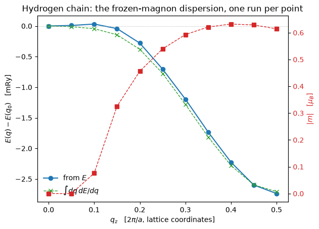

# Spin spirals, without a supercell

A flat spiral turns the moment by $\mathbf q\cdot\mathbf R$ from one cell to the next, so it
is periodic only when $\mathbf q$ is commensurate, and a supercell large enough for a general
wavevector is out of reach. The generalized Bloch theorem removes the need: the spiral is a
*gauge*, and in the rotated frame the density and the potential are lattice periodic again.

$$\psi_{n\mathbf k}(\mathbf r) = e^{i\mathbf k\cdot\mathbf r}
  \begin{pmatrix}
    e^{-i\mathbf q\cdot\mathbf r/2}\; u^{\uparrow}_{n\mathbf k}(\mathbf r) \\[3pt]
    e^{+i\mathbf q\cdot\mathbf r/2}\; u^{\downarrow}_{n\mathbf k}(\mathbf r)
  \end{pmatrix}
\qquad\Longrightarrow\qquad
\uparrow \text{ at } \mathbf k + \tfrac{\mathbf q}{2},
\quad
\downarrow \text{ at } \mathbf k - \tfrac{\mathbf q}{2}$$

The up component of the spinor lives at $\mathbf k + \mathbf q/2$ and the down at
$\mathbf k - \mathbf q/2$, each on its own plane-wave sphere. **Any** wavevector in the zone
is then a one-cell calculation, which is what makes a magnon dispersion affordable at all.

`pw.x` has no spin spiral, so the validation is a set of limits: at the wavevectors where a
supercell *is* possible, the spiral has to reproduce it, and it does --

| limit | what it must equal | agreement |
|---|---|---|
| $q = 0$ | an ordinary noncollinear run | 1e-12 Ry |
| $q = b_3/2$ | the collinear antiferromagnet of a doubled cell | 1e-12 Ry |
| $q = b_3/4$ | a four-cell 90-degree noncollinear supercell | 1e-12 Ry |

with only the *electronic* energy compared for the last two, since the Ewald sum of a
one-atom cell and of its supercell are genuinely different numbers and agree per atom anyway.


```python
from pathlib import Path

import matplotlib.pyplot as plt
import numpy as np

from defumat import Calculator

PSEUDO, CASES = Path("../tests/data/pseudo"), Path("../tests/data/qe")
CHAIN = (CASES / "h-chain-spiral.in").read_text()

chain = Calculator.from_text(CHAIN, PSEUDO, announce=False, max_iterations=200)
scf = chain.get_scf()
print("hydrogen chain at q = %s:   E = %.9f Ry,   |m| = %.4f mu_B"
      % (chain.system.spiral_q, scf.total_energy,
         np.linalg.norm(scf.magnetization_vector)))
```

    hydrogen chain at q = (0.0, 0.0, 0.25):   E = -0.954746110 Ry,   |m| = 0.5396 mu_B


One atom per cell, a chain along $z$, and a quarter-turn spiral. In the *rotated* frame this
is an ordinary self-consistent run: the density is lattice periodic, the mixer and the
functional are untouched, and the whole of the implementation is that the two spinor
components sit on two different spheres.

## `E(q)`: the frozen-magnon dispersion

Scanning $\mathbf q$ costs one self-consistent run per point and no supercell at all, which
is the whole reason the theorem is worth having. Where the curve falls away from $q = 0$ the
chain prefers to twist, and fitting a Heisenberg model to it gives the exchange constants a
spin model would be built from.


```python
scan = chain.get_spiral_scan([[0.0, 0.0, q] for q in np.linspace(0.0, 0.5, 11)],
                             gradients=True, max_iterations=200)

ax = scan.plot()
ax.set_title("Hydrogen chain: the frozen-magnon dispersion, one run per point")
print("all %d points converged: %s" % (len(scan.energies), bool(np.all(scan.converged))))
```

    all 11 points converged: True


    

    


The curve falls away from $q = 0$ all the way to the zone boundary, so the ground state of
this chain is the antiferromagnet at $q = b_3/2$ -- which is what notebook 14 relaxes to
without being told.

**The moment does not merely change along it, it collapses.** Below $q \approx 0.15$ the
chain has no moment at all: a slow spiral costs the two channels less than polarising them
gains, so the self-consistent solution is the non-magnetic one and $E(q)$ is flat there. A
Heisenberg model has nothing to describe on that stretch, which is why the fit divides by
$|m|^2$ rather than assuming a fixed spin length, and why the two-shell residual is 2% rather
than nothing.

## The same curve, from its own slope

$E(\mathbf q)$ can also be had without evaluating $E$ anywhere. The slope $dE/d\mathbf q$ is
a derivative of the total energy itself rather than an expression derived by hand for it, and
a curve is the integral of its own slope along the path the scan walks:

$$E(\mathbf q_n) - E(\mathbf q_0)
  = \sum_m \int \mathrm{d}\mathbf q \cdot \frac{\partial E}{\partial \mathbf q}.$$

Both routes describe the same magnet, and comparing them is worth the trouble because they
meet the finite basis differently. The energies are computed on a plane-wave basis rebuilt at
every wavevector, so each carries a small step wherever a plane wave crosses the cutoff; the
slope is taken at a fixed basis and has no such step in it.


```python
q = scan.wavevectors[:, 2]
print("   q      E(q) [mRy]    from dE/dq [mRy]")
for qi, direct, slope in zip(q, scan.relative, scan.integrated):
    print("%6.2f  %11.3f  %16.3f" % (qi, direct, slope))

falls = lambda curve: int(np.sum(np.diff(curve) < 0))
print("\nlargest difference between the two routes   %.3f mRy"
      % np.abs(scan.relative - scan.integrated).max())
print("of %d steps, the number going downhill:  from E %d,  from dE/dq %d"
      % (len(q) - 1, falls(scan.relative), falls(scan.integrated)))

```

       q      E(q) [mRy]    from dE/dq [mRy]
      0.00        0.000             0.000
      0.05        0.008            -0.011
      0.10        0.032            -0.044
      0.15       -0.042            -0.144
      0.20       -0.280            -0.382
      0.25       -0.704            -0.775
      0.30       -1.196            -1.281
      0.35       -1.733            -1.815
      0.40       -2.225            -2.280
      0.45       -2.598            -2.595
      0.50       -2.738            -2.707
    
    largest difference between the two routes   0.102 mRy
    of 10 steps, the number going downhill:  from E 8,  from dE/dq 10


Both routes put the ground state at the zone boundary and agree on how deep it is, to
$0.1$ mRy on a curve $2.7$ mRy deep. Where they part is the way down: the directly computed
energies are not monotone on a curve that falls throughout, while the integrated one is.

That difference is the finite basis and not the magnet. Repeating this scan at
`ecutwfc = 60` instead of $25$ brings the two curves from $0.10$ mRy apart to $0.03$, and
the part of *that* which is the integration rule rather than the basis falls away too as
more wavevectors are added: the two agree to $0.005$ mRy once it is gone. So neither route
is missing anything the other has, and the gap at a modest cutoff is the price of the
basis. Which of the two is nearer the converged answer is a further question that the
agreement does not settle.

Three things the slope route does not buy, since the hope that it might is a natural one. It
is not cheaper: every point still needs its own self-consistent run, because the slope is
evaluated on the converged state. It does not tolerate a coarser $k$-mesh, since the slope is
the exact derivative of the same $k$-sampled energy and inherits the same sampling error. And
it wants a *tighter* convergence threshold rather than a looser one, an energy being
stationary with respect to the density where a derivative is not.


```python
from defumat.workflows.spiral import heisenberg_exchange   # no facade route to a fit

RY_TO_MEV = 13605.693122994
SHELLS = [[0.0, 0.0, 1.0], [0.0, 0.0, 2.0]]        # nearest and next-nearest neighbours

q = scan.wavevectors[:, 2]
J = heisenberg_exchange(scan, chain.system.cell, SHELLS)
model = sum(J[n] * (1.0 - np.cos(2.0 * np.pi * q * (n + 1))) for n in range(len(SHELLS)))
model = model * np.mean(np.linalg.norm(scan.moments, axis=1)) ** 2
residual = np.max(np.abs(model - (scan.energies - scan.energies[0])))

print("J1 = %+.3f meV  (nearest)      J2 = %+.3f meV  (next-nearest)"
      % (J[0] * RY_TO_MEV, J[1] * RY_TO_MEV))
print("largest residual of the two-shell fit   %.3f meV   (%.1f%% of the curve)"
      % (residual * RY_TO_MEV,
         100 * residual / max(abs(scan.energies - scan.energies[0]))))
```

    J1 = -112.256 meV  (nearest)      J2 = +28.989 meV  (next-nearest)
    largest residual of the two-shell fit   0.814 meV   (2.2% of the curve)


A negative $J_1$ is antiferromagnetic in the convention
$H = -\sum J_{ij}\,\mathbf e_i\cdot\mathbf e_j$, which is what a curve falling away from
$q = 0$ has to give. Two shells already capture the curve; a third would be measuring the
sampling error rather than the physics.

**The moment is a gauge and the energy is not.** Running at $\mathbf q$ and at
$\mathbf q + \mathbf b_3$ gives the same energy and a *different* cell-integrated moment: the
rotated frame is a choice, and only frame-independent quantities are physical.

## What it refuses

**Spin-orbit coupling, permanently** -- it ties the spin to the lattice and breaks the
theorem outright, and Elk refuses the combination for the same reason. **Symmetry**, until
the spin space group is written, so a spiral runs `nosym` on the full k-grid. And
**ultrasoft or PAW datasets**, until the augmentation charge *between the two components* is
threaded through -- that is $q_{ij}(\mathbf q)$ and not the ordinary $q_{ij}$, a different
object that the two-sphere structure is exactly what makes necessary.

---
Notebook 14 relaxes $\mathbf q$ itself downhill, which costs a fraction of the runs this scan
does. The tests behind this notebook: `tests/regression/test_spin_spirals.py`, which holds
the three limits of the table above, the gauge invariance of the energy under
$\mathbf q \to \mathbf q + \mathbf b$, and the two-sphere basis construction.
