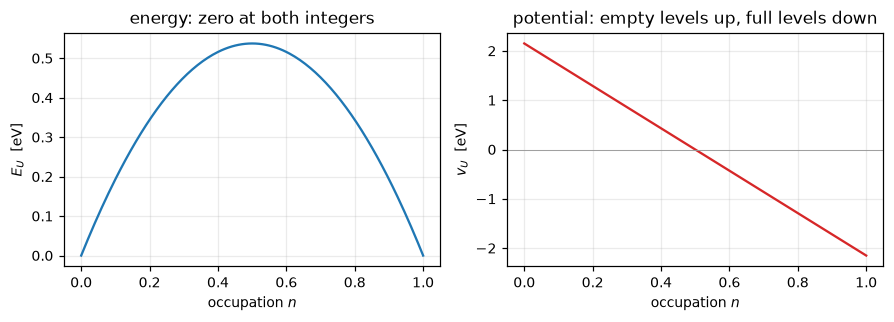

# DFT+U

LDA and GGA are too happy with fractional occupation of a localised shell, which is why
they make a metal out of an insulating transition-metal oxide. Dudarev's correction adds a
penalty that is zero at every integer occupation and positive in between, so the SCF is
pushed towards orbitals that are filled or empty rather than partly both:

$$E_U = \sum_{I,\sigma} \frac{U^I - J^I_0}{2}\,
   \mathrm{Tr}\Big[ n^{I\sigma} \big( 1 - n^{I\sigma} \big) \Big],
\qquad
n^{I\sigma}_{mm'} = \sum_{n\mathbf k} f_{n\mathbf k\sigma}
   \langle \psi_{n\mathbf k\sigma} | \varphi^I_{m'}\rangle
   \langle \varphi^I_{m} | \psi_{n\mathbf k\sigma}\rangle$$

Its potential pushes empty levels up and full ones down by roughly $U/2$ each way, which
is the Mott physics the underlying functional is missing.

`U`, `J0`, `alpha` and `beta` are read from the `HUBBARD` card, on `atomic`,
`ortho-atomic` or `norm-atomic` projectors. Seven cases match Quantum ESPRESSO to
**6.7e-9 Ry or better**, the Hubbard term itself to 4.6e-7 Ry, and the Hubbard force to
4.8e-6 Ry/bohr.


```python
from pathlib import Path

import jax.numpy as jnp
import matplotlib.pyplot as plt
import numpy as np

from pypresso.hubbard.energy import (coefficients_from_setup, hubbard_potential,
                                     qe_hubbard_potential)
from pypresso.hubbard.manifold import build_hubbard_setup
from pypresso import Calculator
from pypresso.io import read_qe_output
from pypresso.io.pwin import parse_pw_input
from pypresso.pseudo.atomic import atomic_wavefunctions
from pypresso.units import RY_TO_EV

PSEUDO, GENERATED = Path("../tests/data/pseudo"), Path("../tests/data/qe")
TESTSUITE = Path("../quantum_espresso/qe-7.5-ReleasePack/qe-7.5/test-suite")
plt.rcParams.update({"figure.dpi": 110, "font.size": 9})


def load(text):
    """A calculator carrying the input's own mixing settings.

    These are the cases that need them: a Hubbard SCF is stiff, and
    `mixing_fixed_ns` holds the occupation matrix still for the first few
    iterations. Put on the calculator once, they reach every method.
    """
    pwin = parse_pw_input(text)
    return Calculator.from_text(
        text, PSEUDO, announce=False, conv_thr=1e-10, max_iterations=250,
        mixing_beta=float(pwin.get("electrons", "mixing_beta", 0.7)),
        mixing_fixed_ns=int(pwin.get("electrons", "mixing_fixed_ns", 0)),
    )


u = 4.3 / RY_TO_EV                                   # the FeO benchmark's U, in Ry
n = np.linspace(0.0, 1.0, 201)
fig, axes = plt.subplots(1, 2, figsize=(8.2, 3.0))
axes[0].plot(n, 0.5 * u * (n - n**2) * RY_TO_EV, color="C0")
axes[0].set_ylabel(r"$E_U$  [eV]"); axes[0].set_title("energy: zero at both integers")
axes[1].plot(n, u * (0.5 - n) * RY_TO_EV, color="C3")
axes[1].axhline(0.0, lw=0.6, color="0.6")
axes[1].set_ylabel(r"$v_U$  [eV]")
axes[1].set_title("potential: empty levels up, full levels down")
for ax in axes:
    ax.set_xlabel("occupation $n$"); ax.grid(alpha=0.25)
fig.tight_layout()

feo_input = (TESTSUITE / "pw_lda+U" / "lda+U.in").read_text()
print(feo_input[feo_input.index("HUBBARD"):])
feo = load(feo_input)
system_feo, pseudos_feo = feo.system, feo.pseudos
setup = build_hubbard_setup(system_feo.hubbard, system_feo.structure, pseudos_feo)
for slot, kind in enumerate(setup.types):
    item, name = setup.species[kind], system_feo.structure.species[kind].name
    print("%s: %d%s   U = %.2f eV = %.6f Ry   (the card is in eV; Ry from here on)"
          % (name, item.n, "spdf"[item.l], item.u * RY_TO_EV, item.u))
```

    HUBBARD {atomic}
    U Fe1-3d 4.3
    U Fe2-3d 4.3
    
    Fe1: 3d   U = 4.30 eV = 0.316044 Ry   (the card is in eV; Ry from here on)
    Fe2: 3d   U = 4.30 eV = 0.316044 Ry   (the card is in eV; Ry from here on)


    

    


## What "atomic" means, and why the choice matters

The occupation matrix is defined by a projection, so the answer depends on what is
projected onto. The projectors carry the overlap operator, $S\varphi$ rather than
$\varphi$, since that is what an occupation is in a pseudopotential calculation. And the
atomic orbitals of one atom are not orthogonal to each other at a single k-point: nickel's
`4s` overlaps its `3d`. The `ortho-atomic` set removes that by orthogonalising over all the
atomic orbitals in the cell, and the resulting occupations differ visibly from the plain
atomic ones, which is why the choice is part of the definition of `U`.


```python
nickel = load((GENERATED / "ni-ldau-ortho.in").read_text())
system_ni, pseudos_ni = nickel.system, nickel.pseudos
calc_ni = nickel.calculation
phi = atomic_wavefunctions(pseudos_ni, system_ni.structure, system_ni.cell,
                           calc_ni.basis.smooth, calc_ni.basis.planewaves,
                           system_ni.kpoints)[0]
sphi = calc_ni._overlap(phi, 0)
plain = np.asarray(jnp.conj(phi) @ phi.T)
generalised = np.asarray(jnp.conj(phi) @ sphi.T)

print("nickel: %d atomic orbitals per atom (4s + 3d)" % phi.shape[0])
print("<phi|phi>   diagonal: %s" % np.round(np.diag(plain).real, 4))
print("<phi|S|phi> diagonal: %s" % np.round(np.diag(generalised).real, 4))
print("largest off-diagonal of <phi|S|phi>: %.4f"
      % np.abs(generalised - np.diag(np.diag(generalised))).max())
```

    nickel: 6 atomic orbitals per atom (4s + 3d)
    <phi|phi>   diagonal: [9.8981 0.1514 0.218  0.218  0.1514 0.218 ]
    <phi|S|phi> diagonal: [8.3061 0.8437 1.0323 1.0323 0.8437 1.0323]
    largest off-diagonal of <phi|S|phi>: 0.1857


## The potential is the derivative of the energy

$E_U$ is written down once and the potential is its derivative, with `U`, `J0`, `alpha` and
`beta` all switched on, checked below against the closed form on a random symmetric
occupation matrix.


```python
import copy

check = copy.deepcopy(setup)
for item in check.species:
    if item is not None:
        item.u, item.j0, item.alpha, item.beta = 0.30, 0.05, 0.02, 0.03
coefficients = coefficients_from_setup(check)

rng = np.random.default_rng(0)
block = rng.normal(size=(2, check.nslot, check.ldmx, check.ldmx))
ns = jnp.asarray(0.5 * (block + block.transpose(0, 1, 3, 2)))
print("max |derivative of E_U  -  closed form| = %.3e"
      % np.abs(np.asarray(hubbard_potential(ns, coefficients))
               - qe_hubbard_potential(ns, check)).max())
```

    max |derivative of E_U  -  closed form| = 1.110e-16


## Against Quantum ESPRESSO

Nickel, a metal where `U` is a perturbation, and antiferromagnetic FeO, which is what
DFT+U exists for. Each is run twice: once with `U` set to 1e-8 eV, where the whole
machinery runs and must change nothing, and once for real.


```python
import time

runs = {}
for label, source in (
        ("Ni, U -> 0",
         (GENERATED / "ni-ldau-ortho.in").read_text().replace("U Ni-3d 3.0",
                                                              "U Ni-3d 1.d-8")),
        ("Ni, U = 3 eV, ortho", (GENERATED / "ni-ldau-ortho.in").read_text()),
        ("FeO, U -> 0", (TESTSUITE / "pw_lda+U" / "lda+U-noU.in").read_text()),
        ("FeO, U = 4.3 eV", (TESTSUITE / "pw_lda+U" / "lda+U.in").read_text())):
    started = time.time()
    result = load(source).get_scf()
    stem = {"Ni, U = 3 eV, ortho": "ni-ldau-ortho",
            "FeO, U -> 0": "pw_lda+U-lda+U-noU",
            "FeO, U = 4.3 eV": "pw_lda+U-lda+U"}.get(label)
    reference = read_qe_output(GENERATED / f"reference.out.{stem}") if stem else None
    runs[label] = (result, reference)
    print("  %-22s %5.1f s  %3d iterations" % (label, time.time() - started,
                                               result.iterations))

print("\n%-22s %17s %17s %10s %12s"
      % ("", "E (Ry)", "QE (Ry)", "difference", "E_U (Ry)"))
for label, (result, reference) in runs.items():
    hubbard = result.energy_terms.get("hubbard", 0.0)
    if reference is None:
        print("%-22s %17.9f %17s %10s %12.8f" % (label, result.total_energy, "-", "-",
                                                 hubbard))
    else:
        print("%-22s %17.9f %17.9f %10.2e %12.8f"
              % (label, result.total_energy, reference.total_energy,
                 result.total_energy - reference.total_energy, hubbard))
```

      Ni, U -> 0               3.3 s   13 iterations


      Ni, U = 3 eV, ortho      2.1 s   12 iterations


      FeO, U -> 0             26.7 s   39 iterations


      FeO, U = 4.3 eV         35.7 s   56 iterations
    
                                      E (Ry)           QE (Ry) difference     E_U (Ry)
    Ni, U -> 0                 -85.723399012                 -          -   0.00000000
    Ni, U = 3 eV, ortho        -85.628386898     -85.628386900   2.03e-09   0.09119025
    FeO, U -> 0               -174.824657947    -174.824657950   3.41e-09   0.00000000
    FeO, U = 4.3 eV           -174.471560677    -174.471560670  -6.65e-09   0.31370412


## What the correction actually does to the occupations

The eigenvalues of the occupation matrix are the occupations of the *natural* orbitals of
the shell. Without `U` they sit wherever the band structure puts them; with it they are
pushed towards 0 and 1. That is the entire mechanism, and in FeO it is what opens the gap
and turns a wrongly metallic calculation into the antiferromagnetic insulator the material
is.

Refused rather than approximated: the full Liechtenstein formulation, the intersite `V`,
and a Hubbard `U` on a noncollinear density.


```python
fig, axes = plt.subplots(1, 2, figsize=(8.6, 3.2), sharex=True)
for ax, (label, other) in zip(axes, (("Ni, U -> 0", "Ni, U = 3 eV, ortho"),
                                     ("FeO, U -> 0", "FeO, U = 4.3 eV"))):
    for offset, key in enumerate((label, other)):
        result = runs[key][0]
        values = np.concatenate([np.linalg.eigvalsh(np.asarray(result.ns)[s, slot])
                                 for s in range(result.ns.shape[0])
                                 for slot in range(result.ns.shape[1])])
        ax.plot(values, np.full_like(values, offset), "o", ms=6, alpha=0.7,
                color="C%d" % offset)
    ax.set_yticks([0, 1]); ax.set_yticklabels([label, other], fontsize=8)
    ax.set_xlim(-0.05, 1.05); ax.grid(alpha=0.25, axis="x")
    ax.set_xlabel(r"eigenvalue of $n^{Is}$")
fig.suptitle("U pushes the natural occupations to 0 and 1", fontsize=10)
fig.tight_layout()

for label in runs:
    traces = runs[label][0].hubbard_occupations
    print("  %-22s Tr[ns] up/down  %s"
          % (label, "   ".join("atom %d: %.4f / %.4f" % (atom + 1, t[0], t[1])
                               for atom, t in traces.items())))
```

      Ni, U -> 0             Tr[ns] up/down  atom 1: 4.8335 / 4.0939
      Ni, U = 3 eV, ortho    Tr[ns] up/down  atom 1: 4.8548 / 4.1359
      FeO, U -> 0            Tr[ns] up/down  atom 3: 4.9703 / 1.9687   atom 4: 1.9687 / 4.9703
      FeO, U = 4.3 eV        Tr[ns] up/down  atom 3: 4.9911 / 1.8454   atom 4: 1.8454 / 4.9911


    

    


---
The tests behind this notebook: `tests/regression/test_ldau.py`,
`tests/unit/test_hubbard.py`.
