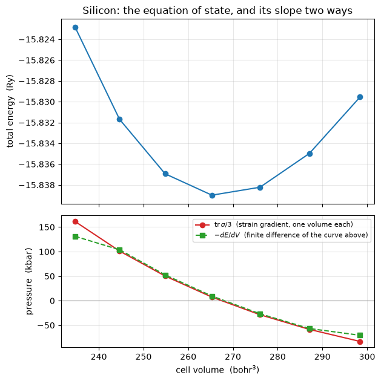

# The stress tensor

The stress says how the total energy responds to deforming the cell, and it is what tells
a calculation whether a crystal is at its equilibrium lattice constant, under pressure, or
unstable:

$$\mathbf a_i \;\to\; (\delta_{ab} + \epsilon_{ab})\,\mathbf a_i,
\qquad
\sigma_{ab} = -\frac{1}{\Omega}
  \left.\frac{\partial E_{\rm tot}}{\partial \epsilon_{ab}}\right|_{\psi\ \rm fixed},
\qquad
P = \tfrac{1}{3}\,\mathrm{tr}\,\sigma$$

Like the force, it is a derivative of the energy taken at frozen wavefunctions, which is
legitimate because the energy is stationary in them; the cell takes the place of the
atoms. On the five silicon references generated for it, it reproduces `pw.x` to
**2.7e-7 Ry/bohr³ or better**, and every one of the seven contributions `pw.x` prints
separately matches to the precision it prints them in.


```python
from pathlib import Path

import matplotlib.pyplot as plt
import numpy as np

from pypresso import Calculator
from pypresso.io import read_qe_output
from pypresso.io.pwin import read_pw_input
from pypresso.pseudo import read_upf
from pypresso.stress import format_stress
from pypresso.system import build_system
from pypresso.units import RY_TO_KBAR

CASES = Path("../tests/data/qe")
PSEUDO = Path("../tests/data/pseudo")


def converged(name, conv_thr=1e-10):
    """A calculator whose ground state is already in hand."""
    calc = Calculator.from_file(CASES / f"{name}.in", pseudo_dir=PSEUDO,
                                announce=False, conv_thr=conv_thr)
    calc.get_scf(max_iterations=100)
    return calc
```

## Run it

`si2-nc-sheared.in` is the two-atom silicon cell with `a3` tilted by 4% in the *xy* plane.
The tilt is deliberate: on the ideal cubic cell the stress is a multiple of the identity,
and a tensor with the wrong shear components would look perfect. Here the crystal has two
symmetry operations and every entry of $\sigma$ is free.


```python
sheared = converged("si2-nc-sheared")
result = sheared.scf_result
stress = sheared.get_stress(terms=True)

print(f"E = {result.total_energy:.8f} Ry")
print(format_stress(stress))
```

    E = -15.78818268 Ry
              total   stress  (Ry/bohr**3)                   (kbar)     P=      -31.13
      -0.00050526  -0.00000855  -0.00013061          -74.33       -1.26      -19.21
      -0.00000855   0.00002509  -0.00014744           -1.26        3.69      -21.69
      -0.00013061  -0.00014744  -0.00015476          -19.21      -21.69      -22.77


## The equation of state

The pressure is a thermodynamic derivative, $P = -dE/dV$, and nothing in the calculation
above knows that: $\sigma$ comes from a derivative taken at **one** volume with the
wavefunctions frozen. Computing `E(V)` by re-converging the SCF at a series of lattice
constants and differentiating the curve is therefore an independent check, and the one
that says the stress is the derivative of the energy the SCF actually minimises.

The cutoff matters here and nowhere else in this notebook. Expanding the cell at fixed
`ecutwfc` lets *more* plane waves inside the cutoff, so the basis improves as the volume
grows and the energy falls for a reason that is not physics. That artefact is the **Pulay
stress**; at the test suite's `ecutwfc = 12` it is larger than the pressure itself, so the
curve below is computed at 40 Ry.


```python
import equinox as eqx
import jax.numpy as jnp

ECUT = 40.0
ALAT = 10.20


def at_scale(scale, ecutwfc=ECUT):
    """Silicon at `alat * scale`, converged, with the sphere reselected.

    The **lattice parameter** is what is scaled, not `cell.at`. Every derived
    quantity then follows -- the reciprocal cell, the FFT grid, and above all
    the k-points, which are stored in units of `2 pi / alat` and would
    otherwise stay where they were in *cartesian* space while the zone moved
    underneath them. That is the trap of this phase and it is silent.
    """
    pwin = read_pw_input(CASES / "si2-nc-stress.in")
    pwin.namelists["system"]["celldm"] = {(1,): ALAT * scale}
    pwin.namelists["system"]["ecutwfc"] = ecutwfc
    pwin.namelists["system"]["ecutrho"] = 4.0 * ecutwfc
    system = build_system(pwin)
    # ...on the *ideal* sites, so the curve is an equation of state and not a
    # mixture of one with a displaced atom relaxing.
    positions = np.array(system.structure.positions)
    positions[1] = np.array([0.25, 0.25, 0.25]) * float(system.cell.alat)
    system = eqx.tree_at(lambda s: s.structure.positions, system,
                         jnp.asarray(positions))
    pseudos = tuple(read_upf(PSEUDO / s.pseudo_file) for s in system.structure.species)
    # Built from a System rather than a file: the cell has been edited in place,
    # so there is no input to read it back from.
    calc = Calculator(system, pseudos, announce=False, conv_thr=1e-10)
    calc.get_scf(max_iterations=120)
    return calc


scales = np.linspace(0.96, 1.04, 7)
volumes, energies, pressures = [], [], []
for scale in scales:
    calc = at_scale(scale)
    volumes.append(float(calc.system.cell.volume))
    energies.append(calc.scf_result.total_energy)
    pressures.append(calc.get_stress().pressure_kbar)

volumes = np.array(volumes)
energies = np.array(energies)
pressures = np.array(pressures)
```


```python
fig, (top, bottom) = plt.subplots(2, 1, figsize=(6.4, 6.4), sharex=True,
                                  gridspec_kw={"height_ratios": [1.4, 1]})

top.plot(volumes, energies, "o-", color="#1f77b4")
top.set_ylabel("total energy  (Ry)")
top.set_title("Silicon: the equation of state, and its slope two ways")
top.grid(alpha=0.3)

# -dE/dV from central differences of the curve above, at the interior points.
numerical = -np.gradient(energies, volumes) * RY_TO_KBAR

bottom.plot(volumes, pressures, "o-", color="#d62728",
            label=r"$\mathrm{tr}\,\sigma/3$  (strain gradient, one volume each)")
bottom.plot(volumes, numerical, "s--", color="#2ca02c",
            label=r"$-dE/dV$  (finite difference of the curve above)")
bottom.axhline(0.0, color="0.6", lw=0.8)
bottom.set_xlabel(r"cell volume  (bohr$^3$)")
bottom.set_ylabel("pressure  (kbar)")
bottom.legend(fontsize=8)
bottom.grid(alpha=0.3)
fig.tight_layout()

interior = slice(1, -1)
residue = np.abs(pressures[interior] - numerical[interior]).max()
print(f"max |tr sigma/3 + dE/dV| over the interior points: {residue:.2f} kbar")
print(f"...against a pressure that spans {pressures.min():.0f} to {pressures.max():.0f} kbar")
```

    max |tr sigma/3 + dE/dV| over the interior points: 2.58 kbar
    ...against a pressure that spans -83 to 161 kbar


    

    


The two curves are the same function computed two ways that share nothing: one is a
derivative taken at a single volume, the other a derivative of a sequence of separate
calculations. What separates them is the Pulay stress, and it is measured here: 1.1 kbar
at 40 Ry, 44 kbar at 12, 0.11 at 60. Any published pressure is only as good as that
number, which is why a convergence test on the cutoff is not optional for a cell under
stress.

The volume where the red curve crosses zero is LDA silicon's equilibrium, and relaxing the
cell down to it is what notebook 23 does.

## Against Quantum ESPRESSO

Five references, each adding one thing to the one before: a displaced cell, a sheared one,
ultrasoft, PAW, and PBE.


```python
rows = []
for case in ["si2-nc-stress", "si2-nc-sheared", "si2-us-stress",
             "si2-paw-stress", "si2-us-pbe-stress"]:
    reference = read_qe_output(CASES / f"reference.out.{case}")
    ours = converged(case).get_stress()
    rows.append((
        case,
        ours.pressure_kbar,
        reference.pressure,
        np.abs(ours.tensor - np.asarray(reference.stress)).max(),
    ))

print(f"{'case':<20} {'P ours (kbar)':>14} {'P QE (kbar)':>12} {'max |dsigma|':>14}")
for name, mine, theirs, diff in rows:
    print(f"{name:<20} {mine:>14.2f} {theirs:>12.2f} {diff:>14.2e}")
```

    case                  P ours (kbar)  P QE (kbar)   max |dsigma|
    si2-nc-stress                -23.58       -23.58       4.31e-08
    si2-nc-sheared               -31.13       -31.13       1.64e-08
    si2-us-stress                 10.53        10.53       2.18e-07
    si2-paw-stress                10.95        10.95       2.19e-07
    si2-us-pbe-stress             47.08        47.08       2.68e-07


## Why the terms come for free

The stress is the derivative of one expression for the energy, so the decomposition into
kinetic, Hartree, local, exchange-correlation, augmentation and Ewald contributions is
obtained by differentiating each term instead of their sum, with no expression derived
separately for any of them.

One subtlety makes the frozen-state derivative the right one. What is held fixed is the
*coefficient vector*: a strain carries the plane waves along with the cell, so freezing the
coefficients freezes the state in crystal coordinates, which is the variational parameter
the SCF minimised over.


```python
for name, tensor in sorted(stress.terms.items()):
    if np.abs(tensor).max() < 1e-12:
        continue
    print(f"{name:>10}  diag(kbar) = "
          + "  ".join(f"{v * RY_TO_KBAR:9.2f}" for v in np.diag(tensor)))
print(f"{'total':>10}  diag(kbar) = "
      + "  ".join(f"{v * RY_TO_KBAR:9.2f}" for v in np.diag(stress.tensor)))

reference = read_qe_output(CASES / "reference.out.si2-nc-sheared")
worst = max(
    np.abs(stress.terms[ours] - np.asarray(reference.stress_terms[qe])).max()
    for qe, ours in [("kinetic", "kinetic"), ("local", "local"),
                     ("hartree", "hartree"), ("ewald", "ewald"),
                     ("nonlocal", "nonlocal")]
)
print(f"\nworst per-term disagreement with pw.x: {worst:.1e} Ry/bohr^3 "
      f"({worst * RY_TO_KBAR:.3f} kbar, which is how finely pw.x prints them)")
```

         ewald  diag(kbar) =  -2965.97   -3292.10   -3124.54
       hartree  diag(kbar) =    225.90     168.00     201.72
       kinetic  diag(kbar) =   2216.41    2308.48    2278.52
         local  diag(kbar) =  -1594.37   -1198.47   -1410.62
      nonlocal  diag(kbar) =   2854.30    2828.38    2842.76
            xc  diag(kbar) =   -810.60    -810.60    -810.60
         total  diag(kbar) =    -74.33       3.69     -22.77
    
    worst per-term disagreement with pw.x: 4.0e-08 Ry/bohr^3 (0.006 kbar, which is how finely pw.x prints them)


---
The tests behind this notebook: `tests/regression/test_stress.py`,
`tests/unit/test_stress_machinery.py`.
