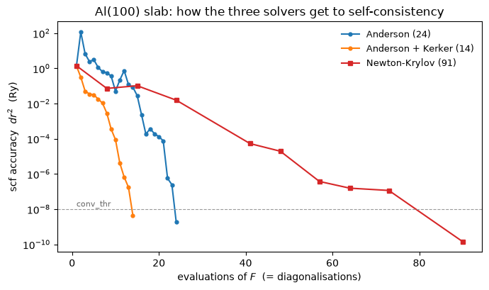

# 17 — Reaching self-consistency: mixing, Kerker, and solving the residual

The SCF is a fixed point, `rho = F(rho)`, and every notebook before this one solved it the
same way `pw.x` does: iterate `F`, damp the iteration with a mixer. This one is about *how*
that fixed point is found, and it has two results.

**Kerker preconditioning is a real and nearly free win.** On an aluminium slab — half metal,
half vacuum — it takes the iteration count from **24 to 14**, for one FFT per iteration.

**Solving the residual `r(rho) = F(rho) - rho = 0` with its own Jacobian is not a speedup,
and it buys something else instead.** Anderson mixing already *is* a quasi-Newton method on
that residual, so an exact Jacobian is an improvement on a fit, not a change of kind — and
it costs 22 to 139 diagonalisations where Kerker costs 14 to 36. What it does that no mixer
can is converge on an **unstable** SCF solution: bcc iron's non-magnetic state, which is a
saddle of the energy and the reference a magnetic stabilisation energy is quoted against.

Self-consistency is a fixed point, and a root of the residual is the same statement:

$$\rho = F[\rho]
\qquad\Longleftrightarrow\qquad
r[\rho] \equiv F[\rho] - \rho = 0$$

Mixing iterates the first; `scf_solver = 'newton-krylov'` solves the second. Kerker
preconditioning divides out the $q^{-2}$ divergence of a metal's dielectric function
before the residual is mixed:

$$\beta \;\longrightarrow\; \beta\,
   \frac{|\mathbf G|^2}{|\mathbf G|^2 + q_{\rm TF}^2}$$


```python
from pathlib import Path
import jax.numpy as jnp
import numpy as np
import matplotlib.pyplot as plt

from pypresso import Calculator
from pypresso.scf import Calculation, run_scf

PSEUDO = Path("../tests/data/pseudo")

def load(name):
    return Calculator.from_file(Path("../benchmarks") / name, pseudo_dir=PSEUDO,
                                announce=False, conv_thr=1e-8, max_iterations=200)

aluminium = load("al-slab.in")
slab, slab_pseudos = aluminium.system, aluminium.pseudos
print(f"Al(100), {len(slab.structure.positions)} layers, "
      f"c = {slab.cell.at[2, 2]:.1f} bohr, {slab.kpoints.coords.shape[0]} k-points")
```

    Al(100), 5 layers, c = 31.0 bohr, 3 k-points


## The problem: half the cell screens, half does not

In a metal the dielectric function diverges as `q^-2` at long wavelength, so the SCF
iteration amplifies long-wavelength charge transfer. A slab has that metal in one half of
the cell and vacuum — no screening at all — in the other. The result is *charge sloshing*,
and it is visible in the first few iterations of a plain Anderson run.


```python
anderson = aluminium.get_scf()
energies = [h["total_energy"] for h in anderson.history]
print(f"Anderson: {anderson.iterations} iterations, E = {anderson.total_energy:.8f} Ry")
print(f"  worst total energy along the way: {max(energies):+.2f} Ry  "
      f"(the converged one is {anderson.total_energy:.2f})")
```

    Anderson: 24 iterations, E = -20.87908220 Ry
      worst total energy along the way: +105.56 Ry  (the converged one is -20.88)


## Kerker: divide the divergence out

`mixing_mode = 'TF'` replaces the scalar `beta` with `beta |G|^2/(|G|^2 + q_TF^2)` acting on
the residual in G-space — QE's `approx_screening` in `mix_rho.f90`. It is an approximate
*inverse Jacobian*, which is exactly what a preconditioner should be.

Two details in it are load-bearing, and both were bugs here first. **`q_TF` is derived from
the cell**, not chosen: `rs = (3 Omega / 4 pi nelec)^(1/3)` and `q_TF^2 = (12/pi)^(2/3)/rs`.
A hand-picked 1.5 1/bohr over-screened this slab by 2.2x in `q^2` and turned a win into a
loss. And **only the charge channel is screened** — the magnetization has no `q^-2`
divergence to divide out, so a spin-polarized density is rotated into
`(charge, magnetization)` around the screening and back.


```python
from pypresso.scf.mixing import thomas_fermi_screening

nelec = aluminium.calculation.nelec
q_tf = thomas_fermi_screening(float(slab.cell.volume), nelec) ** 0.5
print(f"q_TF from the cell = {q_tf:.3f} 1/bohr   (a hand-picked 1.5 over-screens by "
      f"{(1.5/q_tf)**2:.1f}x in q^2)")

kerker = aluminium.get_scf(mixing_mode="kerker")
print(f"Anderson          {anderson.iterations:3d} iterations")
print(f"Anderson + Kerker {kerker.iterations:3d} iterations   "
      f"(same answer to {abs(kerker.total_energy - anderson.total_energy):.1e} Ry)")
```

    q_TF from the cell = 1.008 1/bohr   (a hand-picked 1.5 over-screens by 2.2x in q^2)


    Anderson           24 iterations
    Anderson + Kerker  14 iterations   (same answer to 1.6e-09 Ry)


## The same fixed point, as a root to be found

`scf_solver = 'newton-krylov'` solves `r(rho) = 0` instead of iterating `F`. The Jacobian is
never formed — it would be `(nspin nr)^2`, a 10368 x 10368 matrix on *this*, the smallest
case — so GMRES asks only for `J v`, one directional derivative of one SCF step.

The figure is the convergence history of all three, on the quantity `conv_thr` is compared
against: QE's `dr2`, the Hartree energy of the density residual. **The x axis is
diagonalisations, not iterations** — that is the only currency in which a mixer's step and a
Krylov step are comparable, since a diagonalisation is 84% of an SCF step.


```python
newton = aluminium.get_scf(scf_solver="newton-krylov",
                           scf_solver_options={"forcing": 0.5})

fig, ax = plt.subplots(figsize=(7.0, 4.2))
for label, result, colour in [("Anderson", anderson, "tab:blue"),
                              ("Anderson + Kerker", kerker, "tab:orange")]:
    accuracy = [h["accuracy"] for h in result.history]
    ax.semilogy(np.arange(1, len(accuracy) + 1), accuracy, "o-", ms=3.5,
                color=colour, label=f"{label} ({result.iterations})")
outer = newton.solver.history
ax.semilogy([h["steps"] for h in outer], [h["accuracy"] for h in outer], "s-", ms=4.5,
            color="tab:red", label=f"Newton-Krylov ({newton.solver.steps + newton.iterations})")
ax.axhline(1e-8, color="0.6", lw=0.8, ls="--")
ax.text(1, 1.4e-8, "conv_thr", color="0.4", fontsize=8)
ax.set_xlabel("evaluations of $F$  (= diagonalisations)")
ax.set_ylabel(r"scf accuracy  $dr^2$  (Ry)")
ax.set_title("Al(100) slab: how the three solvers get to self-consistency")
ax.legend(frameon=False, fontsize=9)
fig.tight_layout()

print(f"all three agree to "
      f"{max(abs(r.total_energy - anderson.total_energy) for r in (kerker, newton)):.1e} Ry")
```

    all three agree to 6.2e-08 Ry


    

    


Newton-Krylov's outer count *is* flat — three to six, whatever the conditioning — and it does
not help, because the flatness is bought with GMRES iterations and each one costs a
diagonalisation. Measured over a sweep of vacuum thickness (quoted, not run here — see
`PERFORMANCE.md`):

| vacuum (bohr) | Anderson | Anderson + Kerker | Newton-Krylov |
|---|---|---|---|
| 16 | 24 | **14** | 19 |
| 32 | 34 | **20** | 74 |
| 48 | 32 | **28** | 139 |
| 64 | **35** | 36 | 123 |

So on cost the answer is Kerker, and `mixing` stays the default.

## What the Jacobian is worth: an unstable solution

Iron has two self-consistent solutions at this geometry. The ferromagnetic one is the ground
state; the non-magnetic one is a fixed point of the same equations that damped mixing never
*reaches*, because mixing is a relaxation dynamics and from a physical starting moment it
runs downhill into the stable one. Newton is stability-blind: it converges on whichever root
it started nearest.

**"Nearest" is the operative word, and it has to be arranged rather than hoped for.** An
earlier version of this notebook started both solvers from the atomic superposition and read
off the two answers. That is the one regime where *which* root Newton finds is not
reproducible: a **3.5 eps** change in how `|psi|^2` is evaluated was later enough to send it
to the ferromagnet instead. So the state is perturbed away from the symmetric root and the
*same* perturbed state is handed to both — which is the protocol the DFT+U case below uses,
and it makes the two solvers do visibly opposite things rather than merely land in different
places.

Doing it that way also measures something: this non-magnetic solution is **not a saddle** in
the linear sense but **metastable, with a finite basin**. A kick of 0.05 (in the atomic
magnetization's own shape) decays back to it under mixing; 0.20 runs away. The window where
mixing leaves and Newton returns is 0.08 to 0.12.


```python
ferrum = load("fe-unstable.in")
iron, iron_pseudos = ferrum.system, ferrum.pseudos
options = dict(conv_thr=1e-8, max_iterations=200)

# The symmetric root: nothing in the SCF breaks spin symmetry on its own.
calculation = ferrum.calculation
rho = np.asarray(calculation.starting_density())
symmetric = jnp.asarray(np.repeat(rho.mean(axis=0, keepdims=True), rho.shape[0], axis=0))
root = run_scf(iron, iron_pseudos, calculation=Calculation(iron, iron_pseudos), **options,
               starting_density=symmetric)

# Kick it out of its basin, in the direction the instability lives in, and hand the
# *same* perturbed state to both solvers.
shape = rho[0] - rho[1]
shape = shape / np.abs(shape).max()
base = np.asarray(root.density)
kicked = jnp.asarray(np.stack([base[0] + 0.05 * shape, base[1] - 0.05 * shape]))

mixed = run_scf(iron, iron_pseudos, calculation=Calculation(iron, iron_pseudos), **options,
                starting_density=kicked)
saddle = run_scf(iron, iron_pseudos, calculation=Calculation(iron, iron_pseudos), **options,
                 starting_density=kicked, scf_solver="newton-krylov",
                 scf_solver_options={"forcing": 0.5, "gmres_maxiter": 8,
                                     "max_iterations": 12, "kerker": True})

# The check is free and shares nothing with either run above.
reference = load("fe-unstable-nonmagnetic.in").get_scf()

print(f"{'from the same kicked symmetric root':<40} {'E (Ry)':>15} {'m (mu_B)':>10}")
print(f"{'  Anderson, nspin = 2':<40} {mixed.total_energy:15.8f} "
      f"{float(mixed.magnetization):10.4f}")
print(f"{'  Newton-Krylov, nspin = 2':<40} {saddle.total_energy:15.8f} "
      f"{float(saddle.magnetization):10.4f}")
print(f"{'  nspin = 1 (independent reference)':<40} {reference.total_energy:15.8f} "
      f"{'--':>10}")
print(f"\nNewton's root matches the nspin = 1 reference to "
      f"{abs(saddle.total_energy - reference.total_energy):.1e} Ry")
print(f"iron's magnetic stabilisation energy = "
      f"{1000 * (saddle.total_energy - mixed.total_energy):.1f} mRy")
```

    from the same kicked symmetric root               E (Ry)   m (mu_B)
      Anderson, nspin = 2                       -55.44642602     3.4052
      Newton-Krylov, nspin = 2                  -55.38228995     0.0002
      nspin = 1 (independent reference)         -55.38228995         --
    
    Newton's root matches the nspin = 1 reference to 1.6e-09 Ry
    iron's magnetic stabilisation energy = 64.1 mRy


**A trap worth knowing, because it is silent.** With the preconditioner *off*, the same
solver from the same guess also converges — reporting an accuracy below `conv_thr`, exactly
as above — but on the ferromagnetic solution instead. A Newton method is stability-blind only
to the extent that its inner solve actually delivers the Newton direction; with a badly
conditioned Krylov system the inexact step degrades towards a damped-mixing step, and a
damped-mixing step flows to the stable root. On this kind of problem the preconditioner
decides *which physics comes out*, and both answers look equally converged.

## How the Jacobian action is computed, and why not with `jax.grad`

`J v` is one directional derivative of one SCF step. The obvious route is `jax.jvp` straight
through it — Davidson's `lax.while_loop` included, which forward mode supports. Measured
against a central difference of the same residual, on the slab:

| starting wavefunctions | agreement | wall |
|---|---|---|
| cold (pseudo-atomic orbitals) | **109% apart** | 5.9 s |
| warm (converged `psi`) | 0.8% apart | 2.9 s |
| central difference | — | 0.4 s |

The cold-start disagreement is not a tolerance to be tuned: differentiating Davidson's
*trajectory* from the atomic orbitals is the derivative of a different map, one that merely
lands in the same place. Warm-started, Davidson exits in one or two steps, so its tangent is
a one-step approximation to the eigenvector response. And it is slower either way. So finite
differences are the default backend, and the exact response — a Sternheimer solve, written
down rather than differentiated — is what `PLAN.md` P22c plans.

One piece *did* have to be written down already, and it is the reason a metal works here at
all: `bisect_fermi` halves a bracket, and **differentiating a bisection is silently
useless** — every number in it is a midpoint chosen by a comparison. It carries a
`custom_jvp` with the implicit derivative of `N(E_F) = nelec` instead, which is the
Fermi-level shift term of metallic linear response and outlives the solver that needed it.


```python
import jax, jax.numpy as jnp
from pypresso.scf.occupations import bisect_fermi

levels = jnp.asarray(np.sort(np.random.default_rng(0).normal(size=(4, 8))))
weights, direction = jnp.full(4, 0.5), jnp.asarray(np.random.default_rng(1).normal(size=(4, 8)))
level = lambda e: bisect_fermi(e, weights, 6.0, 0.05, 0)
_, tangent = jax.jvp(level, (levels,), (direction,))
h = 1e-6
print(f"dE_F  rule = {float(tangent):+.10f}   central difference = "
      f"{float((level(levels + h*direction) - level(levels - h*direction)) / (2*h)):+.10f}")
```

    dE_F  rule = -0.1463561264   central difference = -0.1463561264


## The same thing with DFT+U, and the knob that was missing

`ns` is not a function of the density -- the Hubbard potential is built from it before the
Hamiltonian exists -- so `mix_rho.f90` carries it inside `mix_type` and the mixing loop mixes
it beside `rho` and `becsum`. A root-finder solves for it on the same footing, and nothing had
to be added for the Jacobian: `v_hubbard` is already `jax.grad` of the Hubbard energy.

DFT+U has a saddle of its own, and reaching it needed a new input. **`init_ns` fills the
occupation matrix by Hund's rule**, so on a magnetic species the start is 1.0 in every majority
`d` orbital against 0.8 in every minority one -- whether `starting_magnetization` is 0.7 or
0.05. Turning that knob down does not start a run near the unpolarised solution, because the
polarised `ns` regenerates the Hubbard potential that undoes a kick to the density alone. Hence
`run_scf(starting_ns=...)`, with `uniform_ns` to build one.

The test is the definition of an unstable fixed point: perturb it, and see which solver comes
back.


```python
from pypresso.hubbard import uniform_ns

nickel_calc = load("ni-u-unstable.in")
nickel, nickel_pseudos = nickel_calc.system, nickel_calc.pseudos
setup = nickel_calc.calculation
print("init_ns eigenvalues per spin (Hund's rule):",
      *[np.round(np.linalg.eigvalsh(np.asarray(setup.starting_ns())[s, 0]), 2)
        for s in range(2)])

# The saddle: a spin-symmetric density and an orbitally uniform ns.
rho = np.asarray(setup.starting_density())
start = dict(starting_density=jnp.asarray(np.repeat(rho.mean(0, keepdims=True), 2, axis=0)),
             starting_becsum=setup.starting_becsum(),
             starting_ns=uniform_ns(setup.hubbard, setup.nspin))
saddle = run_scf(nickel, nickel_pseudos, calculation=Calculation(nickel, nickel_pseudos),
                 conv_thr=1e-9, max_iterations=150, **start)
print(f"the saddle:  E = {saddle.total_energy:.8f} Ry   m = {float(saddle.magnetization):+.6f}")

# Kick it 2% along the magnetization direction, in both rho and ns.
scale = np.array([1.02, 0.98])[:, None, None, None]
kicked = dict(starting_density=jnp.asarray(np.asarray(saddle.density) * scale),
              starting_becsum=setup.starting_becsum(),
              starting_ns=jnp.asarray(np.asarray(saddle.ns) * scale))

away = run_scf(nickel, nickel_pseudos, calculation=Calculation(nickel, nickel_pseudos),
               conv_thr=1e-9, max_iterations=150, **kicked)
back = run_scf(nickel, nickel_pseudos, calculation=Calculation(nickel, nickel_pseudos),
               conv_thr=1e-9, max_iterations=150, scf_solver="newton-krylov",
               scf_solver_options={"forcing": 0.1, "gmres_maxiter": 30, "max_iterations": 15},
               **kicked)
print(f"{'from the perturbed saddle':<28} {'E (Ry)':>15} {'m (mu_B)':>11}")
print(f"{'  Anderson (runs away)':<28} {away.total_energy:15.8f} {float(away.magnetization):11.6f}")
print(f"{'  Newton-Krylov (returns)':<28} {back.total_energy:15.8f} {float(back.magnetization):11.6f}")

```

    init_ns eigenvalues per spin (Hund's rule): [1. 1. 1. 1. 1.] [0.8 0.8 0.8 0.8 0.8]


    the saddle:  E = -86.20620046 Ry   m = +0.000000


    from the perturbed saddle             E (Ry)    m (mu_B)
      Anderson (runs away)          -86.41841670    2.000000
      Newton-Krylov (returns)       -86.20620046    0.000005


Mixing amplifies the kick into the ferromagnet, which is *what makes the state a saddle*, and
Newton puts it back.

**One caveat, and it is the same one as the preconditioner above.** Started *far* from the
saddle -- from Hund's rule, the default -- which root Newton-Krylov finds depends on the
inner-solve accuracy in no systematic way: `forcing = 0.5` gave the ferromagnet, `0.05` a third
solution at `m = -0.34`, and `0.01` the ferromagnet again, all three converged and all three
reporting an accuracy below `conv_thr`. **On a problem with several solutions it is the
starting state that targets one, not the solver's tuning.** From a genuinely small perturbation
the result is robust; from far away no setting makes it so.

---

**Where the detail is.** `PLAN.md` P22 — the two negative results inherited from pyqula (the
SCF solution is a *saddle* of the off-shell energy functional, so minimising the energy
fails; and a scalar-loss optimiser on `||r||^2` stalls because it discards the residual
vector), the full measurement tables, and what P22c would change. `PERFORMANCE.md`, section
"How many iterations, and what a Jacobian costs". Tests:
`tests/regression/test_scf_solvers.py` and `tests/unit/test_fermi_response.py`.
Code: `pypresso/scf/residual.py`, `pypresso/scf/solvers.py`, `pypresso/scf/mixing.py`.
