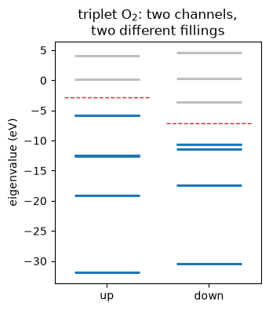

# Linear response: the velocity operator, the Sternheimer equation, and $\varepsilon_\infty$

Everything so far has been a *ground state*, and derivatives of it with respect to where the
atoms are or how the cell is strained. This notebook is about how the ground state
**responds**: to a shift of the crystal momentum, to a change in the potential, and to a
uniform electric field. The last of those is the high-frequency dielectric constant, which
is what a material's refractive index is made of.

On the silicon cell QE runs with `epsil = .true.`:

| | pypresso | `ph.x` |
|---|---|---|
| $\varepsilon_\infty$, norm-conserving Si | **13.806646** | 13.806689 |
| $\varepsilon_\infty$, **ultrasoft** Si | **14.325321** | 14.325270 |
| $\varepsilon_\infty$, **PAW** Si | **14.320211** | 14.320177 |
| $\varepsilon_\infty$, ultrasoft C | **5.756059** | 5.756182 |
| Born charge $Z^*$ (norm-conserving) | **-0.075715** | -0.07571 |

The reference is a re-run of the vendored `ph.x`, since the committed benchmark dates from
release 6.0 and has drifted by 3e-4, six times the disagreement being measured.


```python
from pathlib import Path

import jax.numpy as jnp
import matplotlib.pyplot as plt
import numpy as np

from pypresso import Calculator
from pypresso.io.pwin import read_pw_input
from pypresso.pseudo import read_upf
from pypresso.response import (
    VelocityOperator,
    dielectric_tensor,
    make_sternheimer,
)
from pypresso.scf import Calculation, run_scf
from pypresso.system import build_system
from pypresso.system.kpoints import KPoints
from pypresso.units import RY_TO_EV
from pypresso.workflows import run_bands
from pypresso.workflows.nscf import fixed_density_states

CASES = Path("../tests/data/qe")
PSEUDO = Path("../tests/data/pseudo")

silicon = Calculator.from_file(CASES / "si-epsilon.in", pseudo_dir=PSEUDO,
                              announce=False, conv_thr=1e-12)
system, pseudos = silicon.system, silicon.pseudos
calculation = silicon.calculation
scf = silicon.get_scf()

print(f"total energy   {scf.total_energy:.9f} Ry")
print(f"pw.x           -15.84452726 Ry")
```

    total energy   -15.844527263 Ry
    pw.x           -15.84452726 Ry


## 1. The velocity operator

For a *local* potential the velocity operator would be $\mathbf p$, and a plane-wave code
would need nothing at all, since $\langle k{+}G|\mathbf p|k{+}G\rangle = \mathbf k + \mathbf G$.
A pseudopotential is not local, and $[V_{\rm NL}, \mathbf r] \neq 0$: the nonlocal term
carries a real part of the current, and leaving it out is worth percent-level errors in any
optical quantity.

In the periodic gauge $H(k) = e^{-i k\cdot r} H e^{i k\cdot r}$, so

$$ \frac{\partial H(k)}{\partial k_a} \;=\; i\,[H,\, r_a], $$

and the velocity is the derivative of the Hamiltonian with respect to the crystal momentum.
Applied to a band it gives the group velocity, $\hbar \mathbf v_n = \nabla_{\mathbf k}
\varepsilon_{n\mathbf k}$, which is the quantity a transport calculation integrates.


```python
path = KPoints.band_path(
    [(0.5, 0.5, 0.5), (0.0, 0.0, 0.0), (1.0, 0.0, 0.0)], [30, 30, 0],
    system.cell, crystal=False,
)
bands = run_bands(system, pseudos, scf.density, kpoints=path, nbnd=8, homo=scf.homo)

calc_path, _, path_eigenvalues, path_states = fixed_density_states(
    system, pseudos, scf.density, kpoints=path, nbnd=8, conv_thr=1e-12,
)
operator = VelocityOperator(calc_path, calc_path.potential(scf.density).v_scf)
velocity = operator.band_velocities(path_states, jnp.asarray(path_eigenvalues))

print(velocity.velocities.shape, "  (nk, nbnd, 3), in Ry bohr")
```

    (61, 8, 3)   (nk, nbnd, 3), in Ry bohr


The same call is available directly on the calculator, which is how a script would ask for
it.


```python
same = silicon.get_band_velocities(kpoints=path, nbnd=8)

print(same.velocities.shape, "  the same array, in one call")
print(f"max difference   "
      f"{float(np.max(np.abs(np.asarray(same.velocities) - np.asarray(velocity.velocities)))):.2e}")
```

    (61, 8, 3)   the same array, in one call
    max difference   0.00e+00


The check that this is the right operator is a central difference of the band structure
itself, $\langle\psi|\,dH/dk - \varepsilon\, dS/dk\,|\psi\rangle$ against
$(\varepsilon(k{+}h) - \varepsilon(k{-}h))/2h$. On a generic k-point the two agree to
**1.2e-6 Ry bohr** with a norm-conserving dataset and **8.6e-7** with an ultrasoft one, in
both cases the finite difference's own truncation error.

The ultrasoft case is the one that means something. The overlap operator carries the same
$\mathbf k$ the Hamiltonian does, so the band velocity is the *generalised*
Hellmann-Feynman derivative and $dS/dk$ is part of it: exactly zero for a norm-conserving
dataset, and 1.5e-2 for an ultrasoft one.


```python
x = np.asarray(path.path_length)
energies = bands.eigenvalues_ev - bands.homo * RY_TO_EV
speed = velocity.speeds[0]                     # |d eps / dk|, (nk, nbnd), Ry bohr

fig, ax = plt.subplots(figsize=(6.4, 4.4))
points = ax.scatter(
    np.repeat(x[:, None], energies.shape[1], axis=1).ravel(),
    energies.ravel(), c=speed.ravel(), s=11, cmap="viridis",
)
fig.colorbar(points, ax=ax, label=r"$|d\varepsilon/dk|$   [Ry bohr]")
ax.axhline(0.0, color="k", lw=0.8, ls=":")
for vertex in (x[0], x[30], x[-1]):
    ax.axvline(vertex, color="0.75", lw=0.8)
ax.set_xticks([x[0], x[30], x[-1]])
ax.set_xticklabels(["L", r"$\Gamma$", "X"])
ax.set_ylabel(r"$E - E_{\rm VBM}$   [eV]")
ax.set_title("Silicon's bands, coloured by the velocity operator")
ax.set_xlim(x[0], x[-1])
fig.tight_layout()
```


    

    


The dark points are where $d\varepsilon/dk$ vanishes, at $\Gamma$, at the zone boundary and
at every band extremum in between, and the bright ones are the steep free-electron-like
segments. Nothing in the plot was differenced: each point is an expectation value of an
operator.

## 2. The Sternheimer equation

The response of a state to a perturbation is formally a sum over states,

$$ |d\psi_n\rangle = \sum_{m \neq n} |\psi_m\rangle
   \frac{\langle \psi_m | dV | \psi_n\rangle}{\varepsilon_n - \varepsilon_m}, $$

which needs every empty band and divides by a gap that closes at every degeneracy, and a
crystal is degenerate everywhere by symmetry. The same question written as a linear system,

$$ (H - \varepsilon_n S + \alpha Q)\,|d\psi_n\rangle = -P_c^{+}\, dV\, |\psi_n\rangle, $$

needs no empty states at all and never divides by $\varepsilon_n - \varepsilon_m$. One
projected conjugate-gradient solve per occupied band gives the first-order wavefunction,
and from it the density response $\chi_0\, dV$.


```python
solver = make_sternheimer(calculation, scf)

# A probe potential that is smooth, real, periodic -- and breaks the crystal's symmetry,
# so that what comes back is the response and not an average of it.
grid = calculation.basis.dense.grid
lattice = np.stack(np.meshgrid(*[np.arange(n) / n for n in grid], indexing="ij"), axis=-1)
probe = jnp.asarray(np.cos(2.0 * np.pi * (lattice @ np.array([1, 0, 0])))[None])

solution = solver.solve(solver.perturbation(probe))
response = solver.response_density(solution.dpsi)

print(f"{solution.iterations} CG iterations, residual {solution.residual:.1e}")
print(f"max |chi_0 dV| = {float(jnp.abs(response).max()):.4e} electrons/bohr^3")
```

    26 CG iterations, residual 9.5e-12
    max |chi_0 dV| = 9.5119e-02 electrons/bohr^3


$\chi_0\,dV$ against a central difference of the density under the same perturbation, which
is two diagonalisations instead of a linear solve, agrees to **8e-7 relative**.

This is also the exact Jacobian of the SCF map that notebook 17 could only difference: $F$
takes a density to the density its Hamiltonian produces, so its derivative is $\chi_0 K$
with $K$ the screening kernel.

## 3. An electric field, and $\varepsilon_\infty$

A uniform field is the one perturbation a periodic code cannot simply write down:
$V = \mathbf E \cdot \mathbf r$ is neither bounded nor lattice periodic. What *is* well
defined is $P_c\,\mathbf r|\psi\rangle$, and it is reached through the commutator, which is
the velocity operator of section 1 with a factor of $-i$. The induced charge then screens
the field, and the response has to be solved self-consistently with it, which is what makes
$\varepsilon_\infty$ larger than 1 rather than a first-order shift.


```python
efield = silicon.get_dielectric_tensor()

np.set_printoptions(precision=6, suppress=True)
print("dielectric tensor, cartesian axes:")
print(efield.epsilon)
print(f"\niterations to |ddv_scf|^2 < 1e-14 : {len(efield.history)}")
print(f"departure from cubic             : {efield.anisotropy:.1e}")
```

    dielectric tensor, cartesian axes:
    [[13.806646  0.       -0.      ]
     [ 0.       13.806646  0.      ]
     [-0.       -0.       13.806646]]
    
    iterations to |ddv_scf|^2 < 1e-14 : 8
    departure from cubic             : 4.4e-15


```python
comparison = [
    ("epsilon_infinity", efield.isotropic, 13.806689470),
    ("Born charge Z* (Si 1)", efield.born_charges[0, 0, 0], -0.07571),
    ("Born charge Z* (Si 2)", efield.born_charges[1, 0, 0], -0.07571),
    ("total energy [Ry]", scf.total_energy, -15.84452726),
]
print(f"{'':24s}{'pypresso':>15s}{'ph.x':>15s}{'difference':>14s}")
for name, ours, theirs in comparison:
    print(f"{name:24s}{ours:15.6f}{theirs:15.6f}{ours - theirs:14.2e}")
```

                                   pypresso           ph.x    difference
    epsilon_infinity              13.806646      13.806689     -4.34e-05
    Born charge Z* (Si 1)         -0.075715      -0.075710     -5.01e-06
    Born charge Z* (Si 2)         -0.075715      -0.075710     -5.01e-06
    total energy [Ry]            -15.844527     -15.844527     -2.56e-09


Silicon's Born effective charge is **zero by symmetry** in a converged calculation, so what
$-0.0757$ measures is a residue: the valence charge of 4 against an electronic part near
4.076. Reproducing it to the digits `ph.x` prints is a sharper test than the dielectric
constant, because a difference of large numbers has to come out small in the same way.

The figure below is the physics behind $\varepsilon_\infty = 13.8$ rather than 1: the charge
that piles up against the field. Averaging the induced density over the two directions
perpendicular to the field is exact in reciprocal space, and leaves a function of $x$ alone.


```python
from pypresso.basis.fft import r_to_g

dense = calculation.basis.dense
gcart = np.asarray(dense.cartesian(system.cell))              # (ngm, 3), 1/bohr
along_x = (np.abs(gcart[:, 1]) < 1e-8) & (np.abs(gcart[:, 2]) < 1e-8)

induced_g = np.asarray(r_to_g(jnp.asarray(efield.induced_density[0, 0]), dense.fft_index))
alat = float(system.cell.alat)
grid_x = np.linspace(0.0, alat, 400)
profile = np.real(induced_g[along_x] @ np.exp(1j * np.outer(grid_x, gcart[along_x, 0])).T)

fig2, ax2 = plt.subplots(figsize=(6.4, 3.6))
ax2.plot(grid_x, profile, color="C3", lw=2.0)
ax2.axhline(0.0, color="k", lw=0.8, ls=":")
for tau in np.asarray(system.structure.positions)[:, 0] % alat:
    ax2.axvline(tau, color="0.6", lw=1.0, ls="--")
ax2.set_xlabel("$x$   [bohr]")
ax2.set_ylabel(r"$\overline{\delta\rho}(x)\ /\ E_x$")
ax2.set_title("Induced charge, averaged over the planes normal to the field")
ax2.set_xlim(0.0, alat)
fig2.tight_layout()
```


    

    


The dashed lines are the two silicon atoms. The induced charge vanishes on them and is
extremal between them: the field pushes charge off one side of every bond and onto the
other, and the dipole that makes is what screens it. That the profile is very nearly a
single sinusoid says the response along $x$ is dominated by the shortest reciprocal-lattice
vector in that direction, which is what makes silicon a simple dielectric.

## Ultrasoft and PAW

Everything above ran on a norm-conserving dataset, where the electron density *is*
$|\psi|^2$. On an ultrasoft one it is not: part of the charge lives inside the augmentation
spheres, and it responds to the perturbation along with everything else. Every layer of the
response gains a term because of it, and the dielectric constant is the check that they are
all there.


```python
us_calc = Calculator.from_file(CASES / "si-epsilon-us.in", pseudo_dir=PSEUDO,
                               announce=False, conv_thr=1e-12)
us_field = us_calc.get_dielectric_tensor()
us_born = np.diag(us_field.born_charges[0])[0]
print(f"ultrasoft silicon:  eps = {us_field.isotropic:.6f}    ph.x 14.325270")
print(f"                    anisotropy {us_field.anisotropy:.1e}")
print(f"                    Z*  = {us_born:.6f}      ph.x -0.07945")
```

    ultrasoft silicon:  eps = 14.325321    ph.x 14.325270
                        anisotropy 3.6e-15
                        Z*  = -0.079442      ph.x -0.07945


## The Born charges, which are a *second* derivative

The Born effective charge is the dipole an atom carries when it moves, or equivalently the
force it feels in a field:

$$Z^*_{a,ij} = \frac{\partial F_{a\,j}}{\partial E_i}
             = \frac{\partial^2 E}{\partial u_j\,\partial E_i}$$

It is what makes an optical phonon infrared-active and what splits the longitudinal and
transverse modes of a polar crystal, and it is computed here as the mixed second derivative
it is: the force differentiated once more along the field's response. For an ultrasoft
dataset the augmentation charge contributes its own share of the density, the screening it
feels, and its dipole riding along with the atom; leaving those out gives **+0.1625** on
this cell, wrong in sign as well as size.

Two more, measured the same way and quoted rather than run: **PAW silicon** gives 14.320211
against `ph.x`'s 14.320177, and **ultrasoft carbon**, a different element with a different
cutoff and lattice constant, gives 5.756059 against 5.756182.

## A response has a direction, and symmetry must be applied to it as one

The response to a field along $x$ is not the response to a field along $y$, so on a
symmetry-reduced k-set the three response densities are not what the whole zone would give
and the point group has to put the difference back. What is averaged is a **polar vector
field**, not three independent scalars, and the distinction is worth percent-level errors in
$\varepsilon_\infty$.

The obvious escape is to run the whole k-grid, where there is nothing to put back. It works
only if that grid is closed under the point group, and **a shifted Monkhorst-Pack grid is
not**: 2304 of the 3072 rotation images of a shifted $4\times4\times4$ grid on fcc silicon
land off it. Run anyway, this cell gives a density that is 2% asymmetric, a total energy
3.1e-5 Ry too high, and a dielectric tensor with off-diagonal entries of **3.77 that cubic
symmetry forbids**, all of it looking like a working calculation. That combination is
refused. On an unshifted grid, which is closed exactly, the escape does work: the same
sample reduced to 8 points and symmetrised, and whole at 64 points with no symmetrisation at
all, agree on every digit printed.

## The same solve with two spin channels

Everything above is one spin channel. With two, the response is spin-resolved: the two
channels are filled to different depths and respond independently, which is what a
magnetic system's screening is made of.

Triplet O$_2$ is the picture: seven bands occupied in the majority channel and five in the
minority, both gapped.


```python
oxygen = Calculator.from_file(CASES / "o2-fixed-lsda.in", pseudo_dir=PSEUDO,
                              announce=False, conv_thr=1e-10)
o2 = oxygen.get_scf()

eigenvalues = np.asarray(o2.eigenvalues_by_spin)[:, 0] * RY_TO_EV   # (2, nbnd), Gamma
counts = (7, 5)                                                     # NINT(nelup), NINT(neldw)

print(f"total energy    {o2.total_energy:.8f} Ry     (pw.x -63.36308378)")
print(f"magnetization   {float(o2.magnetization):.4f}")
for s, (label, n) in enumerate(zip(("up", "down"), counts)):
    gap = eigenvalues[s, n] - eigenvalues[s, n - 1]
    print(f"{label:>5}: {n} occupied, gap above the cut {gap:7.3f} eV")

fig, ax = plt.subplots(figsize=(3.4, 4.0))
for s, (label, n) in enumerate(zip(("up", "down"), counts)):
    for b, e in enumerate(eigenvalues[s, :10]):
        ax.hlines(e, s - 0.32, s + 0.32, lw=2.2,
                  color="C0" if b < n else "0.75")
    ax.hlines(0.5 * (eigenvalues[s, n] + eigenvalues[s, n - 1]), s - 0.42, s + 0.42,
              lw=1.0, ls="--", color="C3")
ax.set_xticks([0, 1]); ax.set_xticklabels(["up", "down"])
ax.set_ylabel("eigenvalue (eV)")
ax.set_title("triplet O$_2$: two channels,\ntwo different fillings")
ax.grid(False)
plt.show()
```

    total energy    -63.36308378 Ry     (pw.x -63.36308378)
    magnetization   2.0000
       up: 7 occupied, gap above the cut   5.961 eV
     down: 5 occupied, gap above the cut   7.032 eV


    

    


The dashed lines are where each channel is cut. $\chi_0$ is block diagonal in spin, so a
probe potential that is the same in both channels could never tell the two blocks apart, and
the one below differs between them.


```python
solver2 = make_sternheimer(oxygen.calculation, o2, spin_polarized=True)

grid2 = oxygen.calculation.basis.dense.grid
lattice2 = np.stack(np.meshgrid(*[np.arange(n) / n for n in grid2], indexing="ij"), axis=-1)
wave = np.cos(2.0 * np.pi * (lattice2 @ np.array([1, 0, 0])))
probe2 = jnp.asarray(np.stack([1.0 * wave, -0.5 * wave]))     # (2, n1, n2, n3)

solution2 = solver2.solve(solver2.perturbation(probe2))
response2 = np.asarray(solver2.response_density(solution2.dpsi))

print(f"{solution2.iterations} CG iterations, residual {solution2.residual:.1e}")
for s, label in enumerate(("up", "down")):
    print(f"max |chi_0 dV|  {label:>5}  {np.abs(response2[s]).max():.4e} electrons/bohr^3")
print("\nagainst a central difference of the density, measured in the test file:")
print("  O2 (this cell's solve, the sliced branch)      1.1e-06")
print("  antiferromagnetic H chain (a smeared metal)    1.8e-06")
```

    22 CG iterations, residual 9.2e-12
    max |chi_0 dV|     up  7.9416e-02 electrons/bohr^3
    max |chi_0 dV|   down  2.2815e-02 electrons/bohr^3
    
    against a central difference of the density, measured in the test file:
      O2 (this cell's solve, the sliced branch)      1.1e-06
      antiferromagnetic H chain (a smeared metal)    1.8e-06


The two channels respond differently, which is what a spin-resolved $\chi_0$ is for. The
check that catches a factor of two in the spin sum is not a reference at all: silicon's
$\varepsilon_\infty$ run as `nspin = 1` and as `nspin = 2` with no magnetization comes out
**13.806646105 both ways, 6.2e-14 apart**.

Two limits are refused rather than approximated, and both would otherwise fail quietly. A
filling whose boundary cuts a **degenerate multiplet**, which is most of what fixed-occupation
LSDA is for, has no well-defined response at all: which member of the multiplet falls below
the cut is arbitrary, and the answer depends on that choice. And the *screened* response of a
magnetic system with vacuum does not exist, because the exchange-correlation kernel of LSDA
diverges wherever a channel density reaches zero: on this O$_2$, 1504 of 91125 grid points
have $|m| \ge n$. So $\chi_0$ above is the part that is unconditionally valid, and
$\varepsilon_\infty$ for a magnetic cell needs a magnetization that stays below the charge
everywhere.

---
The tests behind this notebook: `tests/regression/test_response.py`,
`tests/regression/test_lsda_response.py`.
