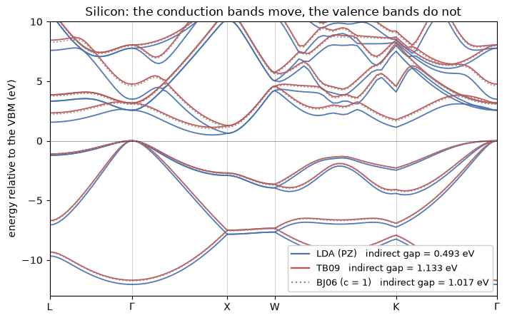

# 24 — Band gaps from the Tran-Blaha potential

A semilocal functional underestimates the band gap, and it does so by about a factor of two.
Silicon's is 1.17 eV; LDA gives 0.5. The usual fixes — a hybrid, or `GW` — cost one or two
orders of magnitude more than the SCF they correct.

**Tran and Blaha's modified Becke-Johnson potential** ([Phys. Rev. Lett. **102**, 226401
(2009)](https://doi.org/10.1103/PhysRevLett.102.226401)) gets most of the gap back for the
price of a gradient-corrected functional. It is written down as a *potential*:

$$v_{x,\sigma}^{\mathrm{mBJ}}(\mathbf r) = c\,v_{x,\sigma}^{\mathrm{BR}}(\mathbf r)
  + (3c-2)\,\frac{1}{\pi}\sqrt{\frac{5}{12}}\,
    \sqrt{\frac{2\tau_\sigma(\mathbf r)}{\rho_\sigma(\mathbf r)}},
\qquad
c = \alpha + \beta\left[\frac{1}{V_{\rm cell}}\int_{\rm cell}
     \frac{|\nabla\rho|}{\rho}\,\mathrm d^3r'\right]^{1/2}$$

with $\alpha = -0.012$, $\beta = 1.023\,a_0^{1/2}$, and $v_x^{\rm BR}$ the Becke-Roussel
model of the exchange hole. $c = 1$ recovers Becke-Johnson.

**This is the one functional in the package that is not the derivative of an energy.** Every
other one is written down as $E_{xc}$ and its potential comes from `jax.grad`; here there is
no $E_x$ at all. So the total energy a TB09 run reports is *not variational*, and forces,
stress, phonons and linear response are refused by name. The eigenvalues are the point.

Three things are worth knowing before the numbers:

- **`pw.x` cannot compute this.** QE reaches TB09 only by linking libxc, and then it passes a
  **zero Laplacian** (`XClib/xc_wrapper_mgga.f90` calls the argument "not used in QE") and
  **never sets $c$**, so libxc uses its default $c = 1$. `input_dft = 'tb09'` in `pw.x` is
  Becke-Johnson without a Laplacian. Both ingredients are here — the Laplacian is
  $-G^2\rho(G)$, one transform.
- **$c$ is not a pointwise quantity.** It is an average over the whole cell, so the potential
  at one point depends on the density everywhere. libxc declines to compute it and says so in
  the parameter's own description.
- **The SCF carries a second field.** $\tau$ comes from the states, not from the density, so
  a run under this functional carries $(\rho, \tau)$ where every other run carries $\rho$.


```python
from pathlib import Path

import matplotlib.pyplot as plt
import numpy as np

from pypresso.io.pwin import Card, read_pw_input
from pypresso.pseudo import read_upf
from pypresso.scf import run_scf
from pypresso.system import build_system
from pypresso.system.kpoints import KPoints
from pypresso.units import RY_TO_EV
from pypresso.workflows import run_bands
from pypresso.xc.functional import get_functional

CASES = Path("..") / "quantum_espresso" / "qe-7.5-ReleasePack" / "qe-7.5" / "test-suite"
PSEUDO = Path("..") / "tests" / "data" / "pseudo"


def silicon(dft=None, ecutwfc=30.0, grid=(6, 6, 6)):
    # QE's own two-atom silicon, at a converged cutoff and an automatic k-grid.
    data = read_pw_input(CASES / "pw_scf" / "scf.in")
    data.namelists["system"].update(ecutwfc=ecutwfc, input_dft=dft)
    data.cards["K_POINTS"] = Card("K_POINTS", "automatic",
                                  (f"{grid[0]} {grid[1]} {grid[2]} 0 0 0",))
    system = build_system(data)
    pseudos = tuple(read_upf(PSEUDO / s.pseudo_file) for s in system.structure.species)
    return system, pseudos


functional = get_functional("tb09")
print(f"name = {functional.name}   is_meta = {functional.is_meta}   "
      f"c = {functional.meta_coefficient}  (None means: average it over the cell)")
print(f"exchange slot = {functional.exchange.__name__}   "
      f"correlation slot = {functional.correlation.__name__}")
```

    name = TB09   is_meta = True   c = None  (None means: average it over the cell)
    exchange slot = no_exchange   correlation slot = pw_correlation


## 1. Two analytic limits pin the functional

There is no Fortran to compare against, so the validation is against limits the model has to
satisfy exactly.

**The hydrogen atom.** For a one-orbital density $D_\sigma = 2\tau_\sigma -
|\nabla\rho_\sigma|^2/4\rho_\sigma$ vanishes identically, so $Q = \nabla^2\rho/6$ whatever
$\gamma$ is, and Becke-Roussel collapses onto the *exact* Slater potential of the 1s orbital.
This pins the sign of $Q$, the branch of the nonlinear solve, the $\rho^{1/3}$ prefactor and
the $\tau$ convention all at once.

**The uniform gas.** Becke-Johnson's $\sqrt{5/12}/\pi$ is chosen so that $v_x^{\rm BJ}$
reproduces $v_x^{\rm LDA}$ there. It does, to 6e-4 — and that residue is the Becke-Roussel
model's own, not the implementation's: it is a steep function of $\gamma$ (2.8% at
$\gamma = 1$), and $\gamma = 0.8$ turns out to be the uniform-gas fit to four digits.


```python
import jax.numpy as jnp

from pypresso.units import E2
from pypresso.xc.mgga import becke_roussel_potential_hartree, tb09_potential

# hydrogen 1s: rho = e^{-2r}/pi, one electron in one spin channel
r = np.linspace(1e-4, 6.0, 4001)
rho = np.exp(-2 * r) / np.pi
model = np.asarray(becke_roussel_potential_hartree(
    jnp.asarray(rho), jnp.asarray((2 * rho) ** 2),
    jnp.asarray((4 - 4 / r) * rho), jnp.asarray(rho / 2),
))
exact = -(1 / r) * (1 - (1 + r) * np.exp(-2 * r))
print(f"hydrogen 1s:  max |v_BR - v_Slater| = {np.abs(model - exact).max():.2e} Ha")

# uniform gas: c = 1 must give back the LDA exchange potential
for n in (0.01, 1.0, 50.0):
    tau = 0.3 * (6 * np.pi**2) ** (2 / 3) * n ** (5 / 3)
    v = float(tb09_potential(jnp.asarray(n), jnp.asarray(0.0),
                             jnp.asarray(0.0), jnp.asarray(tau), 1.0)) / E2
    lda = -((6 * n / np.pi) ** (1 / 3))
    print(f"uniform gas rho_s = {n:5.2f}:  v_BJ = {v:9.6f}   v_LDA = {lda:9.6f}   "
          f"rel = {abs(v - lda) / abs(lda):.2e}")
```

    hydrogen 1s:  max |v_BR - v_Slater| = 1.11e-13 Ha


    uniform gas rho_s =  0.01:  v_BJ = -0.267141   v_LDA = -0.267301   rel = 6.00e-04
    uniform gas rho_s =  1.00:  v_BJ = -1.239957   v_LDA = -1.240701   rel = 6.00e-04
    uniform gas rho_s = 50.00:  v_BJ = -4.568041   v_LDA = -4.570781   rel = 6.00e-04


## 2. Two SCF runs, and the coefficient the second one measures

`input_dft = 'tb09'` is the only thing that changes. The run announces that its total energy
is not variational, takes about twice the iterations LDA takes, and reports the $c$ it settled
on — which moves with the density, and so is part of what has to converge.


```python
import warnings

results = {}
for label, dft in (("LDA (PZ)", None), ("TB09", "tb09"), ("BJ06 (c = 1)", "bj06")):
    system, pseudos = silicon(dft)
    with warnings.catch_warnings():
        warnings.simplefilter("ignore")
        results[label] = (system, pseudos,
                          run_scf(system, pseudos, nbnd=10, conv_thr=1e-9,
                                  max_iterations=90, tstress=False))

for label, (_, _, scf) in results.items():
    c = "    -    " if scf.meta_c is None else f"{scf.meta_c:9.5f}"
    print(f"{label:14s}  {scf.iterations:3d} iterations   c = {c}   "
          f"E = {scf.total_energy:14.8f} Ry")
print("\nThe three energies are NOT comparable with each other: two of them have no"
      "\nexchange energy at all, only the correlation half of etxc.")
```

    LDA (PZ)          6 iterations   c =     -       E =   -15.85056061 Ry
    TB09             10 iterations   c =   1.03310   E =   -11.71980109 Ry
    BJ06 (c = 1)     11 iterations   c =   1.00000   E =   -11.73397051 Ry
    
    The three energies are NOT comparable with each other: two of them have no
    exchange energy at all, only the correlation half of etxc.


## 3. The figure: the same bands, twice

The valence bands are almost untouched — the potential corrects *exchange*, and the occupied
manifold is what the density constrains. The conduction bands move up nearly rigidly, which is
the mechanism in one picture: mBJ acts like a scissor whose size the density itself sets.


```python
FCC = {"L": (.5, .5, .5), "G": (0., 0., 0.), "X": (0., 0., 1.),
       "W": (.5, 0., 1.), "K": (.75, .75, 0.)}
PATH = ["L", "G", "X", "W", "K", "G"]
NOCC = 4

system, pseudos, _ = results["LDA (PZ)"]
COUNTS = [25] * (len(PATH) - 1) + [1]
kpath = KPoints.band_path([FCC[p] for p in PATH], COUNTS, system.cell, crystal=False)

bands, gaps = {}, {}
for label, (system, pseudos, scf) in results.items():
    b = run_bands(system, pseudos, scf.density, kpoints=kpath, nbnd=10,
                  conv_thr=1e-9, tau=scf.tau)
    ev = np.asarray(b.eigenvalues) * RY_TO_EV
    ev = ev - ev[:, :NOCC].max()                   # valence-band maximum at zero
    bands[label] = ev
    gaps[label] = (ev[:, NOCC:].min(),
                   (ev[:, NOCC:].min(axis=1) - ev[:, :NOCC].max(axis=1)).min())

x = np.asarray(kpath.path_length)
# Each segment contributes ``COUNTS[i]`` points, so the high-symmetry vertices
# sit at the running sum of the counts. There are no repeated path lengths to
# find them by: no segment on this path has zero length.
edges = x[np.cumsum([0] + COUNTS[:-1])]
fig, ax = plt.subplots(figsize=(7.2, 4.6))
for label, colour, style in (("LDA (PZ)", "#4c72b0", "-"),
                             ("TB09", "#c44e52", "-"),
                             ("BJ06 (c = 1)", "#8c8c8c", ":")):
    ax.plot(x, bands[label], style, color=colour, lw=1.3, alpha=0.95)
    ax.plot([], [], style, color=colour, lw=1.6,
            label=f"{label}   indirect gap = {gaps[label][0]:.3f} eV")
ax.axhline(0.0, color="k", lw=0.6, alpha=0.4)
for edge in edges[1:-1]:
    ax.axvline(edge, color="k", lw=0.5, alpha=0.25)
ax.set_xticks(edges)
ax.set_xticklabels([p if p != "G" else r"$\Gamma$" for p in PATH])
ax.set_xlim(x[0], x[-1])
ax.set_ylim(-13, 10)
ax.set_ylabel("energy relative to the VBM (eV)")
ax.set_title("Silicon: the conduction bands move, the valence bands do not")
ax.legend(loc="lower right", fontsize=9, framealpha=0.95)
fig.tight_layout()
```

    /u/40/ladovj1/data/Documents/programs/claude/pypresso/pypresso/scf/driver.py:756: UserWarning: input_dft asks for TB09 but the pseudopotentials were generated with PZ; running them together is inconsistent, as it is in QE
      self.functional = resolve_functional(


    /u/40/ladovj1/data/Documents/programs/claude/pypresso/pypresso/scf/driver.py:756: UserWarning: input_dft asks for BJ06 but the pseudopotentials were generated with PZ; running them together is inconsistent, as it is in QE
      self.functional = resolve_functional(


    

    


## 4. Against experiment, and against the published mBJ

The number to compare is the **indirect** gap, $\Gamma_{25'} \to \Delta_{\rm min}$.


```python
EXPERIMENT = {"indirect": 1.17, "direct": 3.40}
PUBLISHED_MBJ = 1.17   # Tran & Blaha 2009, WIEN2k all-electron, c = 1.12

print(f"{'':16s}{'indirect (eV)':>15s}{'direct (eV)':>14s}")
for label in results:
    print(f"{label:16s}{gaps[label][0]:15.3f}{gaps[label][1]:14.3f}")
print(f"{'experiment':16s}{EXPERIMENT['indirect']:15.3f}{EXPERIMENT['direct']:14.3f}")
print(f"\npublished all-electron mBJ (c = 1.12): {PUBLISHED_MBJ:.2f} eV")
print(f"this run's c: {results['TB09'][2].meta_c:.4f}   "
      f"(a pseudopotential has no core, and the core is where |grad rho|/rho is largest)")
```

                      indirect (eV)   direct (eV)
    LDA (PZ)                  0.493         2.567
    TB09                      1.133         3.168
    BJ06 (c = 1)              1.017         3.075
    experiment                1.170         3.400
    
    published all-electron mBJ (c = 1.12): 1.17 eV
    this run's c: 1.0331   (a pseudopotential has no core, and the core is where |grad rho|/rho is largest)


**Where the remaining shortfall comes from, and it is not the implementation.** $c$ averages
$|\nabla\rho|/\rho$ over the cell, and that ratio is largest *in the core* — which a
pseudopotential has removed. Norm-conserving silicon gives $c = 1.033$ where the all-electron
calculation gives 1.12, and the gap grows steadily with $c$. `mbj_c` imposes it, a knob WIEN2k
and VASP both have and `pw.x` has no variable for. Measured once, offline, on this cell:

| `mbj_c` | | indirect gap (eV) | SCF iterations |
|---|---|---|---|
| 1.000 | (= BJ06 — which is what `pw.x` actually runs) | 1.018 | 11 |
| 1.033 | (self-consistent, this pseudopotential) | **1.134** | 10 |
| 1.120 | (the all-electron value of the 2009 paper) | 1.455 | 21 |
| 1.200 | | 1.776 | 23 |
| 1.300 | | 2.215 | 24 |

At the all-electron $c$ this cell *overshoots*: the pseudopotential's $c$ and its density are
not two independent errors, and imposing one without the other is not a correction. Diamond
shows the other half of that: its $c$ comes out at 1.178, its gap goes from LDA's 3.89 eV to
4.43 eV, and it stays 0.5 eV under the all-electron mBJ's 4.93 eV at any $c$ near the measured
one (4.50 eV at $c = 1.20$). It is not a basis-set artefact either — at 90 Ry instead of 60 the
gaps move by 0.03 eV. What the pseudopotential removed is missing from $\tau$ and from the
Laplacian as well as from $c$, and this notebook does not claim to have separated them.

**One thing to watch when reading eigenvalues.** The *highest* band of an `nbnd` window does
not converge under this functional where it does under LDA — at `nbnd = 8` this cell's band 8
sits 4.9e-3 Ry from a dense diagonalisation of the same Hamiltonian while every band below it
is within 5e-7. Davidson resolves the top of its window last, and mBJ's potential mixes that
band with the ones just outside far more than a local one does. The density does not care, so
ask for a few more bands than you intend to read.

## 5. Does it converge?

$\tau$ is not mixed — QE's `mix_rho.f90` does not touch `kin_r` either — so it lags the
density by one iteration; and $c$ couples every grid point to every other. Both are reasons to
expect trouble. Measured on this cell, in **evaluations of $F$** (one diagonalisation each,
which is the only currency in which a mixer and a Krylov solver can be compared):

| | LDA | TB09 |
|---|---|---|
| Anderson mixing, $\beta = 0.7$ | 6 | 11 |
| Anderson mixing, $\beta = 0.3$ | 7 | 19 |
| Newton-Krylov on the residual | 40 | 75 |
| Newton-Krylov after 3 mixing steps | 17 | 59 |

**Mixing wins, and the exact Jacobian does not pay for itself.** That is not a failure of the
residual solver: Anderson mixing *is* a quasi-Newton method on the same residual, building its
Jacobian from the iteration history for nothing, and TB09's fixed point is not ill-enough
conditioned for an exact Jacobian to be worth four inner solves per step. Where the residual
route earns its cost is a problem with more than one solution (`PLAN.md` P22), not one that is
merely slower. What TB09 does cost is a factor of about **1.8 in iterations** over LDA, and
that grows with $c$: at $c = 1.20$ the same cell takes 23.

One thing had to change for the residual route to be defined at all: $\tau$ **joins the packed
state**. A loop may lag whatever it likes; a root-finder needs $F$ to be a function of its
argument, so the fixed point is sought in $(\rho, \tau)$ jointly. That is a deliberate
deviation from QE, and it is what puts the $\partial v/\partial\tau$ block — which runs
through the implicit derivative of the Becke-Roussel inversion — into the Jacobian.


---

**Where the rest is.** The derivation, the trap catalogue and the per-case tables are in
`PLAN.md` §3 under **P30**. The tests are `tests/unit/test_mgga.py` (the analytic limits, the
implicit derivative, the density gate) and `tests/regression/test_mbj.py` (the $\tau$
identity, the two spin regimes agreeing to machine precision, the gap, and the refusals).

**Refused by name:** plain ultrasoft (no partial waves to reconstruct $\tau$ from inside the
sphere, where PAW has them), spin spirals, a Hubbard `U`, and every derivative of the total
energy. **PAW works** (`PLAN.md` P32) and so does noncollinear magnetism with **spin-orbit
coupling** (P31) — `pw.x` refuses both outright (`PW/src/setup.f90`).

