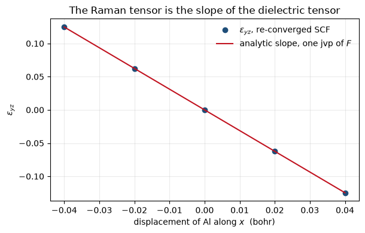

# Raman tensors: two fields and a displacement

The Raman tensor is how a crystal's polarizability changes when an atom moves,

$$ \frac{\partial \varepsilon_{ij}}{\partial \tau_{a,k}}, $$

and it is what a non-resonant Raman intensity is computed from: light scatters off a
vibration because the vibration modulates the dielectric response.

It is a third derivative of the energy, two fields and a displacement, and it is obtained
the same way notebook 21 differentiates along a strain: the second-order energy is
stationary in the first-order wavefunctions, so it can be differentiated with them held
fixed. Everything it needs already exists at that point, since the displacement response is
what the dynamical matrix of notebook 20 solves for and the field response is notebook
19's.

Two things make this quantity unusual. A **gradient-corrected functional** works here, where
`ph.x` stops on "third order derivatives not implemented with GGA", because its third
derivative of the exchange-correlation energy is a hardcoded parameterisation of one
functional. And the reference for it had to be built from scratch: the vendored `ph.x` does
not reproduce QE's own committed example for this quantity and fails its own internal
consistency check, so the comparison here is against a **finite difference of $\varepsilon$
over re-converged displaced cells**.

Headline: **-3.118279** against a finite difference's **-3.118310**, 1.0e-5 relative.


```python
from pathlib import Path

import matplotlib.pyplot as plt
import numpy as np
import jax.numpy as jnp

from pypresso import Calculator
from pypresso.io.pwin import read_pw_input
from pypresso.pseudo import read_upf
from pypresso.response.efield import dielectric_tensor
from pypresso.response.electrostriction import refined_states
from pypresso.response.nonlinear import raman_tensors, require_a_complete_third_derivative
from pypresso.scf import Calculation, run_scf
from pypresso.system import build_system

CASES = Path("../tests/data/qe")
PSEUDO = Path("../tests/data/pseudo")

# AlAs, because zincblende has no inversion centre and silicon does, and because it is the
# system of QE's own Raman example. The k-grid is unshifted and run whole under `nosym`, so
# nothing symmetrises the tensor; notebook 26 runs the same case on the wedge.
alas = Calculator.from_file(CASES / "alas-raman.in", pseudo_dir=PSEUDO,
                            announce=False, conv_thr=1e-12)
system, pseudos = alas.system, alas.pseudos
calculation = alas.calculation
scf = alas.get_scf()

print(f"AlAs   {len(system.kpoints.weights)} k-points, "
      f"total energy {scf.total_energy:.8f} Ry")
print(f"pw.x                            -16.88368446 Ry")
```

    AlAs   64 k-points, total energy -16.88368446 Ry
    pw.x                            -16.88368446 Ry


## 1. One call

Inside it: the self-consistent field response, the self-consistent displacement response,
one further linear solve per mode for the position operator's own derivative, and then the
third derivative.


```python
raman = alas.get_raman_tensors()

print(f"epsilon_infinity        {np.trace(raman.epsilon) / 3:.6f}")
print(f"ph.x                    12.967322")
print(f"field response          {len(raman.field.history)} iterations")
print(f"displacement response   {len(raman.phonon_history)} iterations")
```

    epsilon_infinity        12.967421
    ph.x                    12.967322
    field response          9 iterations
    displacement response   10 iterations


## 2. The tensor, and the two things nothing imposed

AlAs is $\bar 4 3m$. A rank-3 tensor in that point group has exactly one independent
component: the entries with all three indices different are equal, and everything else is
zero. The run uses the whole grid with no symmetrisation anywhere, so those zeros are a
measurement rather than a construction.

The second check is the **translational sum rule**: moving every atom by the same vector
translates the crystal, which cannot change $\varepsilon$, so the tensors sum to zero over
atoms. It is the acoustic sum rule of notebook 20 one derivative up, and like it, it is
reported rather than imposed.


```python
for atom in range(raman.raman.shape[0]):
    label = system.structure.species[system.structure.types[atom]].name
    block = raman.raman[atom, 0]          # displacement along x
    print(f"  atom {atom} ({label:2s}), displaced along x:")
    for row in block:
        print("      " + "".join(f"{v:12.6f}" for v in row))

scale = np.abs(raman.raman).max()
forbidden = max(abs(raman.raman[a, c, i, j])
                for a in range(raman.raman.shape[0])
                for c in range(3) for i in range(3) for j in range(3)
                if len({c, i, j}) != 3)
print(f"\nlargest entry T_d forbids   {forbidden / scale:.1e} of the scale")
print(f"translational sum rule      {raman.sum_rule_relative:.1e} of the scale")
```

      atom 0 (Al), displaced along x:
             -0.000000    0.000000    0.000000
              0.000000   -0.000000   -3.118279
              0.000000   -3.118279   -0.000000
      atom 1 (As), displaced along x:
             -0.000000   -0.000000   -0.000000
             -0.000000    0.000000    3.119166
             -0.000000    3.119166   -0.000000
    
    largest entry T_d forbids   1.6e-13 of the scale
    translational sum rule      2.8e-04 of the scale


## 3. The reference

QE computes the same tensor by a different route, Lazzeri and Mauri's second-order response
to the field, where this is the strictly first-order contraction. Two independent
assemblies of the same number would be the ideal comparison, and it could not be made: the
vendored `ph.x` does not reproduce QE's own committed example for this quantity, and its own
internal check says so, printing a finite-difference dielectric constant of -0.288 beside
its analytic 8.8143 where the older release has 8.8116 beside 8.8147.


```python
rows = [
    ("example05, Raman tensor",        "-0.78497", "-1.86812", "v6.0 / 7.5"),
    ("example05, electro-optic",       "40.4578",  "157.873",  "v6.0 / 7.5"),
    ("example05, eps: analytic",       "8.8147",   "8.8143",   "the two agree"),
    ("example05, eps: its own f.d.",   "8.8116",   "-0.2880",  "they do not"),
]
print(f"{'':32s}{'v6.0 reference':>16s}{'vendored 7.5':>16s}")
for name, old, new, _ in rows:
    print(f"{name:32s}{old:>16s}{new:>16s}")
print("\nTightening eth_rps and eth_ns by four orders moves the last row by 1e-2,")
print("so it is a regression and not a threshold.")
```

                                      v6.0 reference    vendored 7.5
    example05, Raman tensor                 -0.78497        -1.86812
    example05, electro-optic                 40.4578         157.873
    example05, eps: analytic                  8.8147          8.8143
    example05, eps: its own f.d.              8.8116         -0.2880
    
    Tightening eth_rps and eth_ns by four orders moves the last row by 1e-2,
    so it is a regression and not a threshold.


## 4. A third derivative is the slope of a second one

So the reference is built here instead. The dielectric constant can be computed from
scratch at any geometry, so displacing one atom and re-converging gives
$\varepsilon(\tau)$, and the Raman tensor is its slope. The line below is not fitted: it is
the analytic derivative, drawn through the point it was computed at.

Five SCF runs, each followed by its own dielectric response.


```python
steps = np.array([-0.04, -0.02, 0.0, 0.02, 0.04])
base = np.asarray(system.structure.positions)

def epsilon_yz_at(shift):
    positions = base.copy()
    positions[0, 0] += shift
    moved = Calculation(system, pseudos).at_positions(jnp.asarray(positions))
    run = run_scf(system, pseudos, calculation=moved, conv_thr=1e-12, max_iterations=200)
    values, states = refined_states(moved, run)
    tensor = dielectric_tensor(moved, states, values, jnp.asarray(run.density),
                               born_charges=False)
    return float(np.asarray(tensor.epsilon)[1, 2])

curve = np.array([epsilon_yz_at(s) for s in steps])
slope = raman.raman[0, 0, 1, 2]
central = (curve[3] - curve[1]) / (steps[3] - steps[1])
print(f"analytic  d(eps_yz)/d(tau_x) = {slope:.6f}")
print(f"central difference (h=0.02)  = {central:.6f}")
print(f"                    relative   {abs(slope - central) / abs(slope):.1e}")
```

    analytic  d(eps_yz)/d(tau_x) = -3.118279
    central difference (h=0.02)  = -3.118310
                        relative   1.0e-05


```python
fig, ax = plt.subplots(figsize=(6.2, 4.0))
ax.plot(steps, curve, "o", color="#1f4e79", label=r"$\epsilon_{yz}$, re-converged SCF")
fine = np.linspace(steps[0], steps[-1], 100)
ax.plot(fine, curve[2] + slope * fine, "-", color="#c1121f",
        label=r"analytic slope, one $\mathrm{jvp}$ of $F$")
ax.set_xlabel(r"displacement of Al along $x$  (bohr)")
ax.set_ylabel(r"$\epsilon_{yz}$")
ax.set_title("The Raman tensor is the slope of the dielectric tensor")
ax.legend(frameon=False)
ax.grid(alpha=0.25)
fig.tight_layout()
```


    

    


## 5. What is not here: the second-order susceptibility

$\chi^{(2)}$, which governs second harmonic generation, is the same functional
differentiated along a third **field** rather than along a displacement, and it is refused
rather than approximated: the field enters this calculation only through the source term,
so one piece of the 2n+1 expression has nothing to build it from.

The size of what is missing is a measurement rather than an estimate, because the
displacement derivative has the same kind of term and it *is* computed here: zeroing it
changes $d\varepsilon_{yz}/d\tau$ from **-3.118279** to **-1.809983**, which is 42% of the
answer.

And nothing catches its absence by symmetry. Without that term the tensor still vanishes
identically in silicon, still comes out exactly zincblende in AlAs, and is still symmetric
under every permutation of its three labels to 2.5e-13, because the omitted term is
symmetric too. Kleinman's condition is blind to it, which is worth knowing for any tensor of
this rank: symmetry checks constrain the form and say nothing about the size.


```python
try:
    require_a_complete_third_derivative()
except NotImplementedError as error:
    print(str(error))
```

    chi^(2) and the electro-optic tensor are not implemented: the field enters this code only through the source term P_c r|psi> and through the density, so the term of the 2n+1 expression in which the perturbing operator sits between two first-order wavefunctions (<u_i|r_k|u_j>, QE's dvpsi_e2/solve_e2) has nothing to build it from. Its displacement counterpart is computed here and is 42% of the Raman tensor, and no symmetry check catches its absence -- see pypresso.response.nonlinear's module docstring. The Raman tensor, which needs no such term, is raman_tensors()


---
The tests behind this notebook: `tests/regression/test_nonlinear.py`.
