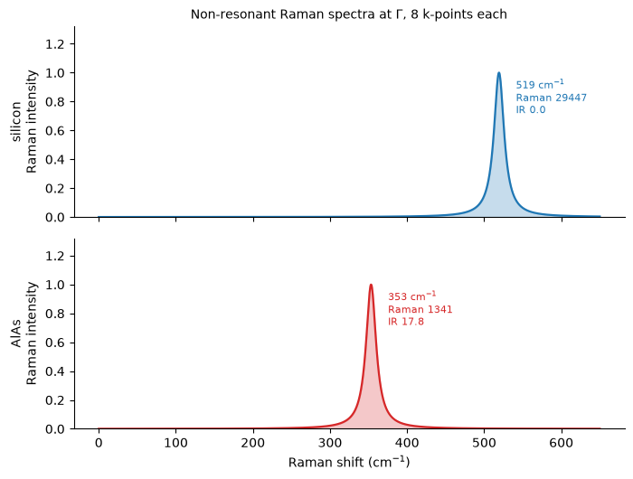

# Raman and infrared spectra

Notebook 25 computed the Raman tensors, notebook 20 the phonon modes and notebook 19 the
Born effective charges. None of those is what a spectroscopist reads. An experiment
resolves a **mode**: a frequency, an intensity and a depolarisation ratio. Getting there is
a contraction of all three quantities with the phonon eigendisplacement,

$$ R^{\nu}_{ij} = \sum_{a,k} \frac{\partial \chi_{ij}}{\partial \tau_{a,k}}\, z^{\nu}_{a,k},
\qquad
p^{\nu}_i = \sum_{a,k} Z^{*}_{a,ik}\, z^{\nu}_{a,k}, $$

with the Raman activity built from the two Placzek invariants of $R^\nu$ and the infrared
activity from $|p^\nu|^2$. A mode is Raman-active if it modulates the polarizability and
infrared-active if it carries a dipole, and those are independent questions.

Silicon's optical triplet comes out at **519.2 cm⁻¹** against an experimental 520, Raman
active and infrared silent, and every digit agrees with the vendored `dynmat.x` run on the
same tensors.


```python
from pathlib import Path

import matplotlib.pyplot as plt
import numpy as np

from pypresso import Calculator
from pypresso.response.spectra import mode_activities, vibrational_spectrum

CASES = Path("../tests/data/qe")
PSEUDO = Path("../tests/data/pseudo")


def converged(case):
    calc = Calculator.from_file(CASES / f"{case}.in", pseudo_dir=PSEUDO,
                                announce=False, conv_thr=1e-12)
    return calc.system, calc, calc.get_scf()


# The same AlAs as notebook 25 and the same unshifted 4x4x4 sample -- but reduced to its
# irreducible wedge, which that notebook had to refuse.
system, alas, scf = converged("alas-raman-wedge")
calculation = alas.calculation      # the three calls below still take one
print(f"AlAs   {len(system.kpoints.weights)} k-points (notebook 25 needed 64)")
print(f"       total energy {scf.total_energy:.8f} Ry   pw.x -16.88368446")
```

    AlAs   8 k-points (notebook 25 needed 64)
           total energy -16.88368446 Ry   pw.x -16.88368446


## 1. One call

Inside it: the field response, the displacement response, the Raman tensors, the Born
effective charges and the dynamical matrix. The two responses are the expensive part, and
the displacement one is shared between the Raman tensors and the phonons, which is why the
whole spectrum costs little more than the phonons alone.

The k-set is the irreducible wedge. A Raman tensor has three free cartesian labels, so a
sum over the wedge is incomplete in all three and the point group has to complete it; with
that, notebook 25's 64 k-points become 8 here.


```python
spectrum = alas.get_vibrational_spectrum()
print(spectrum.table())
```

    # mode   [cm-1]    [THz]      IR          Raman   depol.fact
        1      1.82    0.0545    0.3576         0.0000    0.7500
        2      1.82    0.0545    0.3576         0.0000    0.7500
        3      1.82    0.0545    0.3576         0.0000    0.7500
        4    353.25   10.5902    5.9262       446.8854    0.7500
        5    353.25   10.5902    5.9262       446.8854    0.7500
        6    353.25   10.5902    5.9262       446.8854    0.7500


## 2. What `dynmat.x` says about the same tensors

The dynamical matrix, $\varepsilon$, $Z^*$ and the Raman block are written out in the format
QE's post-processing reads, and the vendored `dynmat.x` re-reads them, re-diagonalises the
matrix with its own eigensolver and prints its own table. This is the one Quantum ESPRESSO
reference above second order that still works, because it is post-processing and never
touches the branch that computes the tensors.

$q$ is left at zero on purpose, which keeps the non-analytic LO-TO term out of both codes.


```python
import subprocess, tempfile
from pypresso.io.dynmat import write_dynamical_matrix
from pypresso.response.nonlinear import raman_tensors

QE_BIN = Path("../quantum_espresso/qe-7.5-ReleasePack/qe-7.5/bin/dynmat.x")

raman = raman_tensors(calculation, scf, born_charges=True, keep_internals=True)

def run_dynmat(system, raman, phonon_matrix):
    with tempfile.TemporaryDirectory() as folder:
        folder = Path(folder)
        write_dynamical_matrix(
            folder / "pp.dynG", system.cell, system.structure, phonon_matrix,
            epsilon=raman.epsilon, born=np.asarray(raman.field.born_charges),
            raman=raman.raman,
        )
        (folder / "in").write_text(
            " &input\n   fildyn = 'pp.dynG'\n   filout = 'out'\n   asr = 'no'\n /\n"
        )
        done = subprocess.run([str(QE_BIN.resolve())], stdin=(folder / "in").open(),
                              capture_output=True, text=True, cwd=folder)
        return done.stdout

from pypresso.response.electrostriction import refined_states
from pypresso.response.phonon import dynamical_matrix
import jax.numpy as jnp

values, states = refined_states(calculation, scf)
phonons = dynamical_matrix(calculation, states, values, jnp.asarray(scf.density),
                           response=raman.displacement)
output = run_dynmat(system, raman, phonons.matrix)
print("\n".join(line for line in output.splitlines()
                 if line.startswith("# mode") or line.strip()[:1].isdigit()
                 and len(line.split()) == 6))
```

    # mode   [cm-1]    [THz]      IR          Raman   depol.fact
        1      1.82    0.0545    0.3576         0.0000    0.7500
        2      1.82    0.0545    0.3576         0.0000    0.7500
        3      1.82    0.0545    0.3576         0.0000    0.7500
        4    353.25   10.5902    5.9262       446.8854    0.7500
        5    353.25   10.5902    5.9262       446.8854    0.7500
        6    353.25   10.5902    5.9262       446.8854    0.7500


Identical, from two contractions that share the tensors and nothing else.

## 3. Silicon: one Raman line, and silence in the infrared

AlAs is polar, so it is active in both channels. Silicon is the interesting case, and both
of its statements are pure symmetry:

* the optical triplet is **Raman active**, diamond's $T_{2g}$, the line at 520 cm⁻¹ that
  every Raman spectrometer is calibrated on;
* it is **infrared silent**, because an operation of the group carries one silicon onto the
  other and so gives them the same $Z^*$. The optical mode moves them against each other,
  so it carries no dipole at all, and that is why silicon is transparent in the infrared.


```python
si_system, si_calc, si_scf = converged("si-epsilon-unshifted")
si = si_calc.get_vibrational_spectrum()
print(si.table())
print(f"\nsilicon T_2g   {si.frequencies[-1]:.1f} cm^-1   (experiment: 520)")
print(f"infrared activity of the optical triplet   {np.abs(si.infrared[3:]).max():.2e}")
```

    # mode   [cm-1]    [THz]      IR          Raman   depol.fact
        1      4.32    0.1295    2.3510         0.0000    0.7499
        2      4.32    0.1295    2.3510         0.0000    0.4967
        3      4.32    0.1295    2.3510         0.0000    0.3834
        4    519.20   15.5654    0.0000      9815.5635    0.7500
        5    519.20   15.5654    0.0000      9815.5635    0.7500
        6    519.20   15.5654    0.0000      9815.5635    0.7500
    
    silicon T_2g   519.2 cm^-1   (experiment: 520)
    infrared activity of the optical triplet   3.61e-31


## 4. The figure

The two spectra, as a spectrometer would record them: each mode a Lorentzian of its
activity on a shared axis. Silicon has one line and AlAs has one, at very different places,
and only AlAs has anything in the infrared.


```python
def broaden(spectrum, grid, width=8.0):
    total = np.zeros_like(grid)
    for freq, activity in zip(spectrum.frequencies, spectrum.raman_activity):
        if freq < 20.0:          # the acoustic modes, which the sum rule silences
            continue
        total += activity * width**2 / ((grid - freq) ** 2 + width**2)
    return total

grid = np.linspace(0, 650, 1400)
fig, (top, bottom) = plt.subplots(2, 1, figsize=(7.2, 5.4), sharex=True)

for axis, data, name, colour in ((top, si, "silicon", "#1f77b4"),
                                 (bottom, spectrum, "AlAs", "#d62728")):
    curve = broaden(data, grid)
    axis.fill_between(grid, curve / curve.max(), color=colour, alpha=0.25)
    axis.plot(grid, curve / curve.max(), color=colour, lw=1.6)
    # One label per *multiplet*, not per mode -- the three members of a triplet
    # sit at the same frequency, and the activity that means anything is their
    # sum (section 5).
    for freq, activity, infrared in data.by_manifold():
        if freq < 20.0:
            continue
        axis.annotate(f"{freq:.0f} cm$^{{-1}}$\nRaman {activity:.0f}\n"
                      f"IR {infrared:.1f}",
                      xy=(freq, 1.0), xytext=(freq + 22, 0.72), fontsize=8,
                      color=colour)
    axis.set_ylabel(f"{name}\nRaman intensity")
    axis.set_ylim(0, 1.32)
    axis.spines[["top", "right"]].set_visible(False)

bottom.set_xlabel("Raman shift (cm$^{-1}$)")
top.set_title("Non-resonant Raman spectra at $\\Gamma$, 8 k-points each", fontsize=10)
fig.tight_layout()
```


    

    


## 5. The one rule about reading these numbers

A degenerate multiplet has no preferred basis: any orthogonal mixing of its members is as
good an answer, and two eigensolvers will return different ones. Both Placzek invariants are
**quadratic** in the mode's Raman tensor, so the multiplet's *sum* of activities survives
that mixing and its individual entries do not. A degenerate multiplet is comparable only as
a sum, between two codes and between two runs.

That is not a caveat that had to be looked for. On silicon's acoustic triplet the two
eigensolvers land in different bases, and both codes print activities of 0.0000 with wildly
different depolarisation ratios beside them.


```python
print("silicon's acoustic triplet, depolarisation ratio, activity 0.0000 in both:")
print(f"  pypresso   {'  '.join(f'{v:.4f}' for v in si.depolarisation[:3])}")
print(f"  dynmat.x   0.5873  0.2446  0.7264")
print("\nand the quantities that survive the mixing:")
for freq, raman_sum, ir_sum in si.by_manifold():
    print(f"  {freq:8.2f} cm^-1   Raman {raman_sum:12.4f}   IR {ir_sum:9.4f}")
```

    silicon's acoustic triplet, depolarisation ratio, activity 0.0000 in both:
      pypresso   0.7499  0.4967  0.3834
      dynmat.x   0.5873  0.2446  0.7264
    
    and the quantities that survive the mixing:
          4.32 cm^-1   Raman       0.0000   IR    7.0529
        519.20 cm^-1   Raman   29446.6904   IR    0.0000


## 6. The contraction itself

`z` is the eigendisplacement $u/\sqrt{M}$, normalised by $\langle z|M|z\rangle = 1$:

```
R[nu]   = sum over (atom, cart) of  dchi_dtau[atom, cart, i, j] * z[nu, atom, cart]
p[nu]   = sum over (atom, cart) of  Zstar[atom, i, cart]        * z[nu, atom, cart]

alpha   = trace(R) / 3
beta2   = ((R00-R11)^2 + (R00-R22)^2 + (R11-R22)^2 + 6(R01^2+R02^2+R12^2)) / 2

Raman   = 45 alpha^2 + 7 beta^2          depolarisation = 3 beta^2 / (45 alpha^2 + 4 beta^2)
IR      = 2 |p|^2
```

$\alpha$ is the isotropic part of the polarizability change and $\beta^2$ its anisotropy,
which is why the depolarisation ratio distinguishes a totally symmetric mode from every
other one.

---
Not implemented and named rather than approximated: the **non-analytic LO-TO term**, so
AlAs's optical triplet comes out unsplit where a real measurement finds a TO/LO pair, and
the mode-resolved ionic permittivity. Both need only $Z^*$ and $\varepsilon$, which this
notebook has already computed.

The tests behind this notebook: `tests/regression/test_spectra.py`,
`tests/unit/test_spectra.py`.
