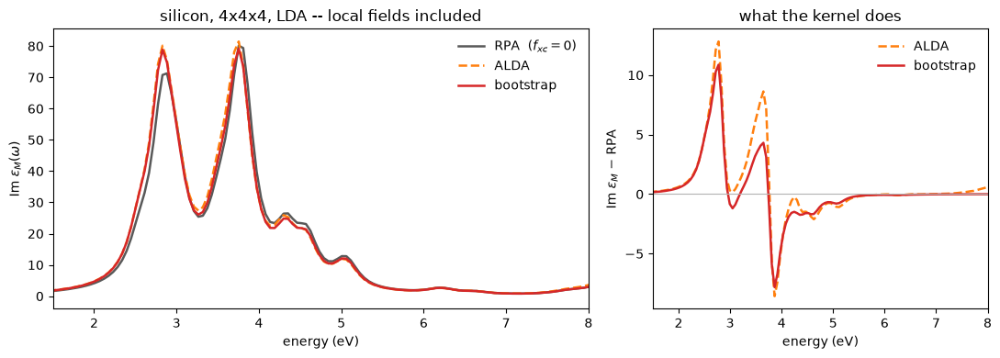

# Excitons and TDDFT: the bootstrap kernel

An absorption spectrum is the imaginary part of the macroscopic dielectric function as a
function of frequency, and getting it means building the independent-particle
susceptibility as a **matrix** over reciprocal lattice vectors,

$$\chi^0_{\mathbf{GG}'}(\omega)=\frac{1}{\Omega}\sum_{\mathbf k}\sum_{ij}
\frac{(f_i-f_j)\,\rho^{ij}_{\mathbf G}\rho^{ij*}_{\mathbf G'}}
{\epsilon_i-\epsilon_j+\omega+i\eta},
\qquad
\rho^{ij}_{\mathbf G}=\langle u_i|e^{-i\mathbf G\cdot\mathbf r}|u_j\rangle$$

and then solving the Dyson equation with an exchange-correlation kernel:

$$\epsilon^{-1}=1+X\left(1-X-\tilde f_{\rm xc}X\right)^{-1},\qquad X=v^{1/2}\chi^0v^{1/2}$$

The kernel decides whether the calculation can describe an **exciton**, a bound
electron-hole pair. The one used here is the **bootstrap** of Sharma, Dewhurst, Sanna and
Gross ([PRL **107**, 186401 (2011)](https://arxiv.org/abs/1107.0199)), which is
parameter-free and defined *by* the equation it feeds:

$$f^{\rm BS}_{\rm xc}=-\frac{\epsilon^{-1}(\mathbf q,0)\,v(\mathbf q)}{\epsilon_0(\mathbf q,0)-1},
\qquad \epsilon_0=1-v\chi^0$$

so the two are solved together until they stop moving, which takes nine iterations on
silicon. It diverges as $1/q^2$ as the wavevector goes to zero, and that long-ranged
attraction is what binds the pair. Quantum ESPRESSO has no counterpart to it.

**How this is validated.** There is no other code's spectrum to compare against, since an
all-electron LAPW spectrum is not the same number as a pseudopotential plane-wave one. The
check is an identity instead: the same $\epsilon_M(0)$ reached by this sum over states plus
a Dyson inversion, and by the projected conjugate-gradient solve of notebook 19, which
shares no machinery with it and never sees an empty state. They agree to **1.3e-2 on a
constant of 22**, and what is left is the truncation of the sum over empty bands, which is
reported rather than tuned away.


```python
import numpy as np
import matplotlib.pyplot as plt
from pathlib import Path

from pypresso import Calculator
from pypresso.scf import Calculation, run_scf
from pypresso.units import RY_TO_EV

DATA = Path("..") / "tests" / "data"

# The unshifted, closed 4x4x4 grid with `nosym`. chi_0(G, G') is a matrix in *two*
# G indices, and symmetrising it would rotate both at once -- which nothing here
# does -- so this phase needs the whole grid, and an unshifted one is what makes
# running it without symmetry sound in the first place.
silicon = Calculator.from_file(DATA / "qe" / "si-epsilon-unshifted-nosym.in",
                               pseudo_dir=DATA / "pseudo", announce=False,
                               conv_thr=1e-12)
system, pseudos = silicon.system, silicon.pseudos

scf = silicon.get_scf(max_iterations=80)
print(f"{system.kpoints.nk} k-points, E = {float(scf.total_energy):.8f} Ry")
```

    64 k-points, E = -15.83064709 Ry


## The spectrum, three kernels

Building $\chi^0$ is the whole cost and the kernel is nearly free, so the three spectra
below share one $\chi^0$ and differ only in the Dyson equation solved on top of it.


```python
from pypresso.workflows.nscf import fixed_density_states
from pypresso.tddft import independent_response, solve_dyson, alda_matrix
import jax.numpy as jnp, time

# One fixed-density run with empty states. `nbnd` is the convergence parameter of
# this whole phase and nothing can refuse it being too small -- hence the
# residual measured further down.
calc, _, evals, wfs = fixed_density_states(system, pseudos, scf.density,
                                           nbnd=60, conv_thr=1e-10)
potential = calc.potential(jnp.asarray(scf.density))

omega = np.arange(0.0, 0.60, 0.004)                  # Ry
t = time.time()
chi = independent_response(
    calc, wfs, evals, potential.v_scf,
    np.concatenate([[0.0], omega]),   # one extra point at omega = 0: the kernel's
    ecut_response=8.0,                # Elk's gmaxrf -- the G-set chi_0 spans
    broadening=0.012,                 # Elk's swidth, and the width of every peak
)
print(f"chi_0: {chi.nm} x {chi.nm} at {len(omega) + 1} frequencies, "
      f"{chi.npairs} pairs per k-point, {time.time() - t:.0f} s")

context = {"alda_matrix": alda_matrix(calc, jnp.asarray(scf.density), chi.sphere)}
solutions, spectra = {}, {}
for kernel in ("rpa", "alda", "bootstrap"):
    t = time.time()
    solutions[kernel] = solve_dyson(chi, kernel, context)
    epsilon = np.asarray(solutions[kernel].epsilon)[1:]
    spectra[kernel] = np.imag(np.trace(epsilon, axis1=1, axis2=2)) / 3.0
    print(f"  {kernel:10s} {time.time() - t:5.2f} s   "
          f"alpha = {solutions[kernel].alpha:+.4f}   "
          f"{solutions[kernel].iterations} pass(es)")
```

    chi_0: 115 x 115 at 151 frequencies, 224 pairs per k-point, 4 s


      rpa         0.56 s   alpha = -0.0000   1 pass(es)


      alda        0.45 s   alpha = -0.0000   1 pass(es)


      bootstrap   2.80 s   alpha = +0.0232   9 pass(es)


## The figure

An attractive kernel moves oscillator strength **downhill**, towards the absorption edge.
Silicon has no bound exciton, so there is no peak below the gap to find; what shows here is
the redistribution, an enhanced $E_1$ shoulder at the expense of $E_2$, which is what the
bootstrap paper's silicon panel shows.


```python
fig, (ax, axr) = plt.subplots(1, 2, figsize=(11, 4), width_ratios=[1.6, 1])

ev = omega * RY_TO_EV
style = {"rpa": ("0.35", "-", r"RPA  ($f_{xc}=0$)"),
         "alda": ("tab:orange", "--", "ALDA"),
         "bootstrap": ("tab:red", "-", "bootstrap")}
for name, (colour, dash, label) in style.items():
    ax.plot(ev, spectra[name], dash, color=colour, lw=1.8, label=label)
ax.set_xlabel("energy (eV)"); ax.set_ylabel(r"Im $\epsilon_M(\omega)$")
ax.set_title("silicon, 4x4x4, LDA -- local fields included")
ax.legend(frameon=False); ax.set_xlim(1.5, 8)

# The same thing as a difference, which is where the effect actually lives.
for name in ("alda", "bootstrap"):
    axr.plot(ev, spectra[name] - spectra["rpa"], style[name][1],
             color=style[name][0], lw=1.8, label=style[name][2])
axr.axhline(0.0, color="0.7", lw=0.8)
axr.set_xlabel("energy (eV)"); axr.set_ylabel(r"Im $\epsilon_M$ $-$ RPA")
axr.set_title("what the kernel does"); axr.legend(frameon=False); axr.set_xlim(1.5, 8)
fig.tight_layout()

peak = int(np.argmax(spectra["rpa"]))          # a *common* cut for all three
for name in style:
    a = spectra[name]
    print(f"{name:10s} weight below RPA's peak: {a[:peak].sum()/a.sum():.4f}   "
          f"first moment: {(omega*a).sum()/a.sum()*RY_TO_EV:.4f} eV")
```

    rpa        weight below RPA's peak: 0.5706   first moment: 3.6477 eV
    alda       weight below RPA's peak: 0.6138   first moment: 3.5916 eV
    bootstrap  weight below RPA's peak: 0.6085   first moment: 3.5873 eV


    

    


The energy window the weight is measured in has to be **common** to all three spectra.
Measuring each one below its own maximum moves the window with the spectrum and reverses
the answer.

ALDA moves weight too, and it would be wrong to say otherwise. What it cannot do is bind,
and the reason is structural rather than a matter of size.

## The identity that certifies it

Two routes to $\epsilon_M(0)$ that share the ground state and nothing else. The sum over
states builds a matrix from occupied-empty pairs and inverts a Dyson equation; the
Sternheimer route never forms a matrix, never sees an empty state, and solves
$(\hat H-\epsilon_n\hat S)|\Delta\psi\rangle=-\hat P_c\,\mathbf r|\psi\rangle$ by conjugate
gradient.

The two kernels have to match for the comparison to mean anything. The static route's
screening includes $f_{xc}$, so it is the ALDA answer and not the RPA one, and comparing an
RPA sum over states against it leaves a residue that looks exactly like band truncation.


```python
from pypresso.response.efield import dielectric_tensor

nocc = int(round(calc.nelec / 2))

# chi_0 again at omega = 0 with **no** broadening, so it is comparable with a
# Sternheimer solve, which has none either. One frequency, so it is cheap.
static = independent_response(calc, wfs, evals, potential.v_scf, np.array([0.0]),
                              ecut_response=8.0, broadening=0.0)
static_context = {"alda_matrix": alda_matrix(calc, jnp.asarray(scf.density),
                                             static.sphere)}

print(f"{'kernel':10s} {'sum over states':>16s} {'Sternheimer':>13s} {'diff':>9s}")
sternheimer = {}
for kernel, screening in (("rpa", "hartree"), ("alda", "full")):
    reference = dielectric_tensor(calc, wfs[:, :, :nocc], evals[:, :, :nocc],
                                  jnp.asarray(scf.density), screening=screening,
                                  born_charges=False)
    sternheimer[kernel] = float(np.diag(np.asarray(reference.epsilon)).mean())
    solution = solve_dyson(static, kernel, static_context)
    here = float(np.real(np.diag(np.asarray(solution.epsilon)[0])).mean())
    print(f"{kernel:10s} {here:16.4f} {sternheimer[kernel]:13.4f} "
          f"{here - sternheimer[kernel]:9.1e}")

mismatch = abs(sternheimer["alda"] - sternheimer["rpa"])
print(f"\nMismatch the pairing and the residue is {mismatch:.3f} on ~22 -- "
      f"{100 * mismatch / sternheimer['rpa']:.0f}%, and it is f_xc,")
print("not a convergence error. That is what the `screening` switch is for.")
```

    kernel      sum over states   Sternheimer      diff


    rpa                 22.3322       22.3451  -1.3e-02


    alda                23.6214       23.6088   1.3e-02
    
    Mismatch the pairing and the residue is 1.264 on ~22 -- 6%, and it is f_xc,
    not a convergence error. That is what the `screening` switch is for.


## Why ALDA cannot bind, in one line of output

The symmetrised kernel is $\tilde f_{xc}=v^{-1/2}f_{xc}v^{-1/2}$. ALDA's $f_{xc}$ is
**finite** at $\mathbf q=0$ while the Coulomb interaction $v$ **diverges**, so its head and
wings vanish identically and the optical limit never feels it. The bootstrap's do not
vanish, because its numerator carries $v(\mathbf q)$ itself. That is the entire difference
between the two, and it is a statement about shape rather than about magnitude: no
adiabatic local kernel binds an exciton, however strong it is made.


```python
for name in ("alda", "bootstrap"):
    f = np.asarray(solutions[name].fxc)[0]
    print(f"{name:10s} |head| = {np.abs(f[:3, :3]).max():.3e}   "
          f"|wings| = {np.abs(f[:3, 3:]).max():.3e}   "
          f"|body| = {np.abs(f[3:, 3:]).max():.3e}")

print("\nAnd the one-call entry point, which does all of the above at once:")
print("    from pypresso.workflows import run_absorption")
print("    run_absorption(system, pseudos, scf.density, omega,")
print("                   kernel='bootstrap', nbnd=60, ecut_response=8.0,")
print("                   broadening=0.012, scissor=0.05)")
```

    alda       |head| = 0.000e+00   |wings| = 0.000e+00   |body| = 3.173e+00
    bootstrap  |head| = 1.847e-03   |wings| = 5.025e-04   |body| = 4.204e-02
    
    And the one-call entry point, which does all of the above at once:
        from pypresso.workflows import run_absorption
        run_absorption(system, pseudos, scf.density, omega,
                       kernel='bootstrap', nbnd=60, ecut_response=8.0,
                       broadening=0.012, scissor=0.05)


## Two things that leave a perfectly plausible spectrum

**$\epsilon_M$ is the inverse of the $3\times3$ head of $\epsilon^{-1}$, not the head of the
inverse of the whole matrix.** The two are different physics: the second is exactly the
no-local-field result, smooth, positive, with the right peaks and 9% too large. Local field
effects are the difference between them.

**Truncating the sum over empty bands has no symptom.** An undersized sum gives a spectrum
that looks fine, so the residue against the band-complete static route is reported. It has
to be compared kernel for kernel and scissors for scissors, since differencing two routes
measures every way they differ: a 0.05 Ry scissors shift on one side alone turns a residual
of $+0.013$ into $-3.46$.

---
The tests behind this notebook: `tests/regression/test_tddft.py`,
`tests/unit/test_tddft_machinery.py`.

Refused rather than approximated: finite $\mathbf q$, ultrasoft and PAW, metals, spin in any
form, a symmetry-reduced k-set, ALDA with a gradient-corrected functional, and a bootstrap
fixed point that has not converged.
