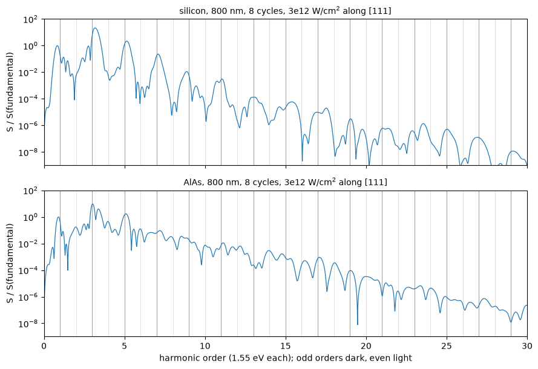

# 50. High harmonics: the light a crystal emits under a strong pulse

What does a crystal radiate while a laser pulse drives it hard enough to carry its
electrons a good part of the way across the Brillouin zone? It radiates at the
laser frequency and at its multiples, far into the ultraviolet, which is what is
called high-harmonic generation, and in a solid it is a property of the band
structure: the field drags every electron along its band, where the velocity is
not a linear function of k, and lifts some of them across the gap, so the current
it drives stops being proportional to the field.

The way we compute it is by propagating the occupied states in time. The field
enters as a shift of every crystal momentum by $\boldsymbol\kappa(t)=\mathbf A(t)/c$,
so each state evolves under the Bloch Hamiltonian at a displaced k-point,

$$i\,\partial_t\,|u_{n\mathbf k}(t)\rangle=H\big(\mathbf k+\boldsymbol\kappa(t)\big)\,|u_{n\mathbf k}(t)\rangle ,$$

and the macroscopic current is the derivative of the band energy with respect to
that shift, at fixed states,

$$\mathbf J(t)=-\frac{1}{\Omega}\sum_{n\mathbf k}w_{n\mathbf k}\,
\Big\langle u_{n\mathbf k}(t)\Big|\,\frac{\partial H}{\partial\mathbf k}\Big|_{\mathbf k+\boldsymbol\kappa(t)}\Big|\,u_{n\mathbf k}(t)\Big\rangle ,$$

meaning that nothing is expanded in the field, however strong it is. What a
spectrometer behind the sample records is the power this current radiates,

$$S(\omega)=\big|\,\omega\,\mathbf J(\omega)\big|^2 .$$

The potential is held at the ground state's, so the electrons respond to the
laser and not to each other's rearrangement, which is the independent-particle
response. For an 800 nm pulse of eight cycles at $3\times10^{12}$ W/cm$^2$, polarized
along [111], on a 4x4x4 mesh at the cutoffs of the two input files:

| | silicon | AlAs |
|---|---|---|
| inversion centre | yes | no |
| 4th harmonic over the 5th | 0.0095 | 0.26 |
| 8th harmonic over the 7th | 0.0016 | 0.35 |
| highest odd harmonic above $10^{-6}$ of the fundamental | 19th, 29 eV | 25th, 39 eV |

These numbers have no reference: `pw.x` has no real-time propagation, and Elk,
which has one, has not been run on this pulse.


```python
from pathlib import Path
import matplotlib.pyplot as plt

from defumat import Calculator
from defumat.realtime.pulse import Sin2  # a pulse is built by the caller, and the Calculator has no constructor for one

PSEUDO, CASES = Path("../tests/data/pseudo"), Path("../tests/data/qe")
pulse = Sin2.from_intensity(3e12, 1.55, 8, polarization=(1, 1, 1))  # W/cm^2, eV, cycles
silicon = Calculator.from_file(CASES / "si2-symmetric.in", PSEUDO, announce=False)
si = silicon.get_hhg(pulse, dt=0.2, nbnd=8)
print("odd harmonics 1 to 15 over the fundamental:",
      " ".join(f"{si.harmonic(n) / si.harmonic(1):.0e}" for n in range(1, 16, 2)))
```

    odd harmonics 1 to 15 over the fundamental: 1e+00 2e+01 2e+00 2e-01 1e-02 3e-03 1e-04 5e-05


## What the numbers mean

The pulse is the 800 nm light of a titanium-sapphire laser, 1.55 eV a photon, with
a $\sin^2$ envelope eight periods long, 21 fs, and a peak intensity of
$3\times10^{12}$ W/cm$^2$, which is a peak field $E_0$ of 4.75 V/nm. What the
electrons feel is the vector potential, and its amplitude
$\kappa_0=E_0/\omega=0.16$ bohr$^{-1}$ is three tenths of the distance from $\Gamma$
to L, the edge of the zone along [111], so you can think of every electron as being
swept back and forth along its own band, three tenths of the way to the zone edge
on either side, eight times. The
step is 0.2 atomic units of time, 4.8 as, and `nbnd = 8` is there because six
bands would end inside a degenerate pair of conduction bands at three k-points of
AlAs.

The odd harmonics are there and the even ones are not. The reason is inversion. It
maps the crystal onto itself and sends the field to its opposite, so the current
driven by $-\mathbf E$ is $-\mathbf J$, and a periodic drive is reversed half a
period later, $\mathbf E(t+T/2)=-\mathbf E(t)$; together they give
$\mathbf J(t+T/2)=-\mathbf J(t)$, meaning that the current has only odd multiples
of $\omega$ in it. A pulse is periodic only inside its envelope, so the even
harmonics are not zero but one to three orders of magnitude below their
neighbours in the table further down, and further still at the troughs
themselves.

Let us now drive zincblende AlAs, which has the same lattice and no inversion
centre, with the same pulse.


```python
alas = Calculator.from_file(CASES / "alas-raman-wedge.in", PSEUDO, announce=False)
zb = alas.get_hhg(pulse, dt=0.2, nbnd=8)
print(f"electrons per cell left in the conduction bands: silicon {si.realtime.excited:.2f}, AlAs {zb.realtime.excited:.2f}")
```

    electrons per cell left in the conduction bands: silicon 0.31, AlAs 0.42


```python
fig, axes = plt.subplots(2, 1, figsize=(9, 6.2), sharex=True)
for axis, spectrum, name in ((axes[0], si, "silicon"), (axes[1], zb, "AlAs")):
    axis.semilogy(spectrum.orders, spectrum.total / spectrum.harmonic(1), lw=0.9)
    for n in range(1, 31):
        axis.axvline(n, color="0.55" if n % 2 else "0.85", lw=0.6, zorder=0)
    axis.set(ylim=(1e-9, 1e2), ylabel="S / S(fundamental)")
    axis.set_title(f"{name}, 800 nm, 8 cycles, 3e12 W/cm$^2$ along [111]", fontsize=10)
axes[1].set(xlim=(0, 30), xlabel="harmonic order (1.55 eV each); odd orders dark, even light")
plt.tight_layout()
```


    

    


## Reading the spectrum

In silicon the spectrum is a comb of odd harmonics, a peak at every odd multiple
of 1.55 eV and a trough at every even one, and it reaches the 19th, at 29 eV,
before it falls below a millionth of the fundamental. Up to the 13th, about 20 eV,
the odd harmonics fall by roughly a decade every two orders, which is the regime
where the $n$-th harmonic is the response of $n$-th order in the field; from there
on the fall slows to about a decade every four or five orders, and this slower
stretch is what is called the plateau, with the cutoff where it gives out. In AlAs
every integer is there: the 4th harmonic is a quarter of the 5th, and from the 8th
on the even harmonics are comparable to the odd ones beside them. This is the
second-order response, the one that gives AlAs its second-harmonic generation,
carried into every order by the strong field.

The cutoff moves with the field. Measured offline on the same mesh and pulse, the
highest odd harmonic of silicon above a millionth of the fundamental is the 9th at
$10^{12}$ W/cm$^2$, the 15th at $2\times10^{12}$, the 19th at $3\times10^{12}$, the 27th
at $4\times10^{12}$ and the 31st at $5\times10^{12}$, from 14 to 48 eV. A level read off
a floor is a coarse measure, so these five points do not decide between a cutoff
linear in the field and one linear in the intensity. At $10^{13}$ W/cm$^2$ the pulse
leaves 2.4 of the eight valence electrons per cell in the conduction bands and the
comb is lost above the 11th harmonic.

The table reads each harmonic as the largest value within a quarter of an order of
it, so for silicon the even entries are upper bounds: they take the flanks of the
odd peaks on either side, and the troughs themselves are deeper.


```python
print(f"{'order':>6s}{'eV':>7s}{'silicon':>11s}{'AlAs':>11s}   over the fundamental")
for n in range(1, 15):
    print(f"{n:6d}{1.55 * n:7.1f}{si.harmonic(n) / si.harmonic(1):11.1e}{zb.harmonic(n) / zb.harmonic(1):11.1e}")
print("highest odd harmonic above 1e-6 of the fundamental:", si.cutoff(floor=1e-6), "and", zb.cutoff(floor=1e-6))
```

     order     eV    silicon       AlAs   over the fundamental
         1    1.6    1.0e+00    1.0e+00
         2    3.1    3.2e-02    1.7e-01
         3    4.7    2.1e+01    9.3e+00
         4    6.2    2.1e-02    4.5e-01
         5    7.8    2.2e+00    1.7e+00
         6    9.3    1.8e-03    1.2e-01
         7   10.8    2.3e-01    9.3e-02
         8   12.4    3.6e-04    3.3e-02
         9   14.0    1.1e-02    2.6e-02
        10   15.5    1.6e-04    7.5e-03
        11   17.1    3.1e-03    1.1e-02
        12   18.6    3.0e-05    6.5e-03
        13   20.2    1.3e-04    8.8e-04
        14   21.7    8.0e-06    3.0e-03
    highest odd harmonic above 1e-6 of the fundamental: 19 and 25


## What forbids an even harmonic

What removes an even harmonic is not inversion as such but any operation of the
crystal that sends the field to its opposite, and zincblende has one along some
directions and not along others. Along [100] the two-fold rotation about [010]
maps AlAs onto itself and sends $E_x$ to $-E_x$, so the current along the field is
odd in the field, exactly as in silicon, and the even harmonics go again; along
[111], the polar axis of zincblende, no operation of the crystal reverses the field,
and they stay. Measured offline with the same pulse along [100], AlAs's 4th, 6th
and 8th harmonics are $1.5\times10^{-2}$, $7\times10^{-4}$ and $9\times10^{-5}$ of
the fundamental, against 0.45, 0.12 and $3.3\times10^{-2}$ along [111], so which
harmonics a crystal emits is a property of the crystal and of the polarization
together, which is what an experiment that turns the sample in the beam measures.
Along [110] the rotation about [001] reverses the field as well but leaves a
current along [001] as it is, so there the even harmonics come out polarized
perpendicular to the field.

## How far to trust it

The mesh is the coarse one, 20 points of the field's little group on 4x4x4, and
it decides the low harmonics. Measured offline on 8x8x8, silicon's third harmonic
is 1.3 times the fundamental rather than 21, and the electrons left excited are
0.71 per cell rather than 0.31, so the strength of the first few harmonics here is
a statement about where a handful of k-points sit against the interband
resonances and not about silicon. From the 11th on the odd harmonics of the two meshes agree
within a factor of two up to the 23rd, both put the cutoff at the 19th, and the
parity of the harmonics, which is a statement of symmetry, holds on any mesh the
crystal maps onto itself. The step of 0.2 gives the same harmonics as a step of
0.1 to 0.1 per cent up to the 21st. Silicon's plane-wave cutoff is its input's
12 Ry, and at 20 Ry the odd harmonics up to the 13th move by at most a factor of 2.2 while the
plateau above them does not hold: the 15th moves by a factor of seven, and the
spectrum stays above a millionth of the fundamental to the 23rd and then drops by
two decades at the 25th. So the end of the plateau, 29 eV here, is the one number
in this notebook that needs a larger basis before it is quoted, and AlAs's 10 Ry
has not been checked at all.

What the calculation leaves out is the rest of the physics of a real sample. The
gap is the LDA's, less than half of the 1.17 eV measured in silicon; the potential is held
fixed, so the excited carriers do not screen the field and there are no excitons;
and nothing dephases, so the coherence the pulse builds between the bands lasts to
the end of the run. Published calculations add a dephasing time of a few
femtoseconds, or propagate the pulse through the sample, and converge the mesh far
beyond this one.

## What it refuses

The propagation needs a norm-conserving dataset: with ultrasoft or PAW projectors
moving with $\mathbf k+\boldsymbol\kappa(t)$ the overlap changes in time and the
equation of motion gains a term, which is refused by name rather than dropped. It
also refuses spin, collinear and spinor alike, DFT+U, a spin spiral, a ground
state converged under a magnetic field or a constrained moment, and a run stored
at $\Gamma$ alone. The k-set has to be a whole unshifted Monkhorst-Pack grid or the
little group of the field built from one: the field breaks both the crystal's
group and time reversal, so a wedge of the crystal's own group is refused, and a
shifted grid is refused because the group does not map it onto itself. A fixed
occupation that cuts a degenerate pair of bands is refused, and so is a time step
past the bound where the propagation stops being stable. `get_hhg` needs a pulse
with a carrier frequency; a kick goes to `get_realtime_dielectric` instead.

The checks behind this notebook are in `tests/unit/test_realtime.py` (the field as
minus the derivative of the vector potential, a state with no field staying
stationary, the work the field does against the energy the crystal gains),
`tests/unit/test_realtime_radial.py`, and `tests/regression/test_realtime.py`, where
the current on the field's little group is compared with the whole mesh's and the
linear response after a kick with a sum over states.
